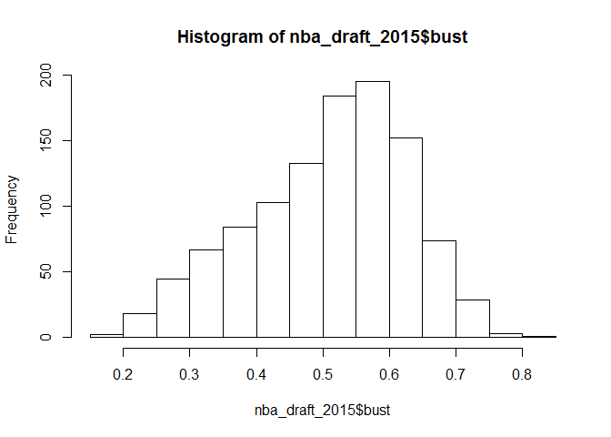

> The data frame we are going to explore today is nba_draft_2015 (Projecting The Top 50 Players In The 2015 NBA Draft Class).

For what NBA stands for, see the footnote[^1] .


nba_draft_2015 from fivethrityeight is basically the raw data behind the story ["Projecting The Top 50 Players In The 2015 NBA Draft Class"](https://fivethirtyeight.com/features/projecting-the-top-50-players-in-the-2015-nba-draft-class/). An analysis using this data was contributed by G. Elliott Morris as a [package vignette](http://fivethirtyeight-r.netlify.com/articles/nba.html).

It is a data frame with 1090 rows representing National Basketball Association players/prospects and 9 variables.
Here we can find some descriptions about the variables.

```
##   variable_name                                 variable_description
## 1        player                                          Player name
## 2      position                                The player's position
## 3            id                     The player's identification code
## 4    draft_year   The year the player was eligible for the NBA draft
## 5 projected_spm projected statistical -/+ over yrs 2-5 of NBA career
## 6     superstar          Probability of becoming a superstar player 
## 7       starter    Probability of becoming a starting-caliber player
## 8   role_player                Probability of becoming a role player
## 9          bust                       Probability of becoming a bust
```
### Here is a summary of the data frame:

```
##     player            position              id              draft_year  
##  Length:1090        Length:1090        Length:1090        Min.   :2001  
##  Class :character   Class :character   Class :character   1st Qu.:2005  
##  Mode  :character   Mode  :character   Mode  :character   Median :2009  
##                                                           Mean   :2008  
##                                                           3rd Qu.:2012  
##                                                           Max.   :2015  
##  projected_spm       superstar            starter         role_player     
##  Min.   :-1.6847   Min.   :0.0000000   Min.   :0.00426   Min.   :0.07613  
##  1st Qu.:-1.2109   1st Qu.:0.0001052   1st Qu.:0.03510   1st Qu.:0.32285  
##  Median :-1.0281   Median :0.0008274   Median :0.06702   Median :0.36811  
##  Mean   :-0.8101   Mean   :0.0114125   Mean   :0.12401   Mean   :0.35572  
##  3rd Qu.:-0.5639   3rd Qu.:0.0056225   3rd Qu.:0.18696   3rd Qu.:0.40371  
##  Max.   : 1.7768   Max.   :0.1819789   Max.   :0.65572   Max.   :0.54387  
##       bust       
##  Min.   :0.1614  
##  1st Qu.:0.4299  
##  Median :0.5250  
##  Mean   :0.5089  
##  3rd Qu.:0.5964  
##  Max.   :0.8263
```
### Here is an interactive and a non-interative table of the data frame:

<!--html_preserve--><div id="htmlwidget-bb4f96b4856d11c9f626" style="width:100%;height:auto;" class="datatables html-widget"></div>
<script type="application/json" data-for="htmlwidget-bb4f96b4856d11c9f626">{"x":{"filter":"none","data":[["1","2","3","4","5","6","7","8","9","10","11","12","13","14","15","16","17","18","19","20","21","22","23","24","25","26","27","28","29","30","31","32","33","34","35","36","37","38","39","40","41","42","43","44","45","46","47","48","49","50","51","52","53","54","55","56","57","58","59","60","61","62","63","64","65","66","67","68","69","70","71","72","73","74","75","76","77","78","79","80","81","82","83","84","85","86","87","88","89","90","91","92","93","94","95","96","97","98","99","100","101","102","103","104","105","106","107","108","109","110","111","112","113","114","115","116","117","118","119","120","121","122","123","124","125","126","127","128","129","130","131","132","133","134","135","136","137","138","139","140","141","142","143","144","145","146","147","148","149","150","151","152","153","154","155","156","157","158","159","160","161","162","163","164","165","166","167","168","169","170","171","172","173","174","175","176","177","178","179","180","181","182","183","184","185","186","187","188","189","190","191","192","193","194","195","196","197","198","199","200","201","202","203","204","205","206","207","208","209","210","211","212","213","214","215","216","217","218","219","220","221","222","223","224","225","226","227","228","229","230","231","232","233","234","235","236","237","238","239","240","241","242","243","244","245","246","247","248","249","250","251","252","253","254","255","256","257","258","259","260","261","262","263","264","265","266","267","268","269","270","271","272","273","274","275","276","277","278","279","280","281","282","283","284","285","286","287","288","289","290","291","292","293","294","295","296","297","298","299","300","301","302","303","304","305","306","307","308","309","310","311","312","313","314","315","316","317","318","319","320","321","322","323","324","325","326","327","328","329","330","331","332","333","334","335","336","337","338","339","340","341","342","343","344","345","346","347","348","349","350","351","352","353","354","355","356","357","358","359","360","361","362","363","364","365","366","367","368","369","370","371","372","373","374","375","376","377","378","379","380","381","382","383","384","385","386","387","388","389","390","391","392","393","394","395","396","397","398","399","400","401","402","403","404","405","406","407","408","409","410","411","412","413","414","415","416","417","418","419","420","421","422","423","424","425","426","427","428","429","430","431","432","433","434","435","436","437","438","439","440","441","442","443","444","445","446","447","448","449","450","451","452","453","454","455","456","457","458","459","460","461","462","463","464","465","466","467","468","469","470","471","472","473","474","475","476","477","478","479","480","481","482","483","484","485","486","487","488","489","490","491","492","493","494","495","496","497","498","499","500","501","502","503","504","505","506","507","508","509","510","511","512","513","514","515","516","517","518","519","520","521","522","523","524","525","526","527","528","529","530","531","532","533","534","535","536","537","538","539","540","541","542","543","544","545","546","547","548","549","550","551","552","553","554","555","556","557","558","559","560","561","562","563","564","565","566","567","568","569","570","571","572","573","574","575","576","577","578","579","580","581","582","583","584","585","586","587","588","589","590","591","592","593","594","595","596","597","598","599","600","601","602","603","604","605","606","607","608","609","610","611","612","613","614","615","616","617","618","619","620","621","622","623","624","625","626","627","628","629","630","631","632","633","634","635","636","637","638","639","640","641","642","643","644","645","646","647","648","649","650","651","652","653","654","655","656","657","658","659","660","661","662","663","664","665","666","667","668","669","670","671","672","673","674","675","676","677","678","679","680","681","682","683","684","685","686","687","688","689","690","691","692","693","694","695","696","697","698","699","700","701","702","703","704","705","706","707","708","709","710","711","712","713","714","715","716","717","718","719","720","721","722","723","724","725","726","727","728","729","730","731","732","733","734","735","736","737","738","739","740","741","742","743","744","745","746","747","748","749","750","751","752","753","754","755","756","757","758","759","760","761","762","763","764","765","766","767","768","769","770","771","772","773","774","775","776","777","778","779","780","781","782","783","784","785","786","787","788","789","790","791","792","793","794","795","796","797","798","799","800","801","802","803","804","805","806","807","808","809","810","811","812","813","814","815","816","817","818","819","820","821","822","823","824","825","826","827","828","829","830","831","832","833","834","835","836","837","838","839","840","841","842","843","844","845","846","847","848","849","850","851","852","853","854","855","856","857","858","859","860","861","862","863","864","865","866","867","868","869","870","871","872","873","874","875","876","877","878","879","880","881","882","883","884","885","886","887","888","889","890","891","892","893","894","895","896","897","898","899","900","901","902","903","904","905","906","907","908","909","910","911","912","913","914","915","916","917","918","919","920","921","922","923","924","925","926","927","928","929","930","931","932","933","934","935","936","937","938","939","940","941","942","943","944","945","946","947","948","949","950","951","952","953","954","955","956","957","958","959","960","961","962","963","964","965","966","967","968","969","970","971","972","973","974","975","976","977","978","979","980","981","982","983","984","985","986","987","988","989","990","991","992","993","994","995","996","997","998","999","1000","1001","1002","1003","1004","1005","1006","1007","1008","1009","1010","1011","1012","1013","1014","1015","1016","1017","1018","1019","1020","1021","1022","1023","1024","1025","1026","1027","1028","1029","1030","1031","1032","1033","1034","1035","1036","1037","1038","1039","1040","1041","1042","1043","1044","1045","1046","1047","1048","1049","1050","1051","1052","1053","1054","1055","1056","1057","1058","1059","1060","1061","1062","1063","1064","1065","1066","1067","1068","1069","1070","1071","1072","1073","1074","1075","1076","1077","1078","1079","1080","1081","1082","1083","1084","1085","1086","1087","1088","1089","1090"],["Karl-Anthony Towns","Justise Winslow","Stanley Johnson","Jahlil Okafor","D`Angelo Russell","Dakari Johnson","Devin Booker","Willie Cauley-Stein","Rondae Hollis-Jefferson","Trey Lyles","Sam Dekker","Kelly Oubre Jr.","Tyus Jones","Kevon Looney","Myles Turner","Cliff Alexander","Christian Wood","Frank Kaminsky","Michael Frazier II","Brandon Ashley","Bobby Portis","Andrew Harrison","Rashad Vaughn","Aaron Harrison","Montrezl Harrell","Quinn Cook","Cameron Payne","Chris McCullough","Justin Anderson","Terry Rozier","Vince Hunter","Delon Wright","Jarell Martin","Jordan Mickey","Wayne Blackshear","Chris Walker","T.J. McConnell","J.P. Tokoto","Pat Connaughton","R.J. Hunter","Jerian Grant","Olivier Hanlan","Branden Dawson","Robert Upshaw","Tyler Harvey","Darrun Hilliard","Tyler Haws","Treveon Graham","Rakeem Christmas","Kenneth Smith","Michael Qualls","Aaron White","Alan Williams","Shannon Scott","Isaac Fotu","Keifer Sykes","Juwan Staten","Corey Hawkins","D.J. Newbill","Josh Richardson","Jonathan Holmes","Joseph Young","Wesley Saunders","Richaun Holmes","Anthony Brown","Norman Powell","Josh Smith","Derrick Marks","Marcus Thornton","Terran Petteway","Seth Tuttle","Trevor Lacey","Dez Wells","Larry Nance, Jr.","Sir`Dominic Pointer","Briante Weber","Cady Lalanne","Joel Embiid","Marcus Smart","Noah Vonleh","Aaron Gordon","Andrew Wiggins","Julius Randle","Jabari Parker","Jordan Adams","Gary Harris","Jarnell Stokes","Nik Stauskas","James Young","Glenn Robinson III","Zach LaVine","T.J. Warren","Mitch McGary","Elfrid Payton","Kyle Anderson","Rodney Hood","Tyler Ennis","Scottie Wilbekin","Jerami Grant","Ioannis Papapetrou","P.J. Hairston","Doug McDermott","Johnny O`Bryant III","Spencer Dinwiddie","Aaron Craft","Russ Smith","Adreian Payne","Lamar Patterson","Casey Prather","K.J. McDaniels","Shabazz Napier","Javon McCrea","Travis Bader","Patric Young","Jabari Brown","Cleanthony Early","JaKarr Sampson","Nick Johnson","Will Sheehey","Joe Harris","Langston Galloway","Bryce Cotton","Deonte Burton","Sean Kilpatrick","C.J. Fair","Khem Birch","C.J Wilcox","James Michael McAdoo","Semaj Christon","George Beamon","Jordan McRae","Jordan Clarkson","LaQuinton Ross","Keith Appling","Eric Moreland","Cory Jefferson","Roy Devyn Marble","Geron Johnson","Taylor Braun","DeAndre Kane","Jahii Carson","Mike Moser","Jordan Bachynski","Richard Solomon","Fuquan Edwin","Roscoe Smith","Melvin Ejim","Josh Huestis","Devon Collier","Juvonte Reddic","Markel Brown","Xavier Thames","DeAndre Daniels","Alex Kirk","Shawn Jones","Tarik Black","Alec Brown","Dwight Powell","Victor Oladipo","Nerlens Noel","Otto Porter","Alex Len","Anthony Bennett","Ben McLemore","Cody Zeller","CJ McCollum","Michael Carter-Williams","Kentavious Caldwell-Pope","Steven Adams","Grant Jerrett","Trey Burke","Reggie Bullock","Shane Larkin","Archie Goodwin","Allen Crabbe","Tony Snell","Kelly Olynyk","Tim Hardaway Jr","Adonis Thomas","Deshaun Thomas","B.J. Young","Tony Mitchell","Mason Plumlee","Gorgui Dieng","Vander Blue","Shabazz Muhammad","Erik Murphy","Andre Roberson","Pierre Jackson","Jamaal Franklin","James Southerland","Ryan Kelly","Phil Pressey","Peyton Siva","Glen Rice Jr","D.J. Stephens","Travis Releford","Christian Watford","Isaiah Canaan","Trevor Mbakwe","Matthew Dellavedova","Myck Kabongo","Will Clyburn","Ryan Broekhoff","Seth Curry","Jeff Withey","Rotnei Clarke","Elijah Johnson","Solomon Hill","C.J. Aiken","Nate Wolters","Arsalan Kazemi","Ray McCallum","Mike Muscala","Lorenzo Brown","Kenny Kadji","Khalif Wyatt","Brandon Davies","Rodney Williams","Laurence Bowers","James Ennis","Colton Iverson","Brandon Paul","Erick Green","Amath M`Baye","Carrick Felix","Robert Covington","Jamelle Hagins","Michael Snaer","Ramon Galloway","Will Cherry","C.J. Leslie","Dewayne Dedmon","Elias Harris","Richard Howell","Ed Daniel","Jackie Carmichael","Romero Osby","Zeke Marshall","Anthony Davis","Bradley Beal","Dion Waiters","Michael Kidd-Gilchrist","Thomas Robinson","Andre Drummond","Jared Sullinger","Harrison Barnes","Terrence Jones","Jeremy Lamb","John Henson","Marquis Teague","Austin Rivers","Royce White","Damian Lillard","Tony Wroten","Doron Lamb","Moe Harkless","Perry Jones III","Quincy Miller","Terrence Ross","Jared Cunningham","Meyers Leonard","John Jenkins","Kendall Marshall","Draymond Green","Hollis Thompson","Jae Crowder","Khris Middleton","Ashton Gibbs","Miles Plumlee","Kevin Jones","William Buford","Darius Miller","Gerardo Suero","Arnett Moultrie","Zach Rosen","Robbie Hummel","Tyler Zeller","Jordan Taylor","Tyshawn Taylor","Marcus Denmon","Ricardo Ratliffe","John Shurna","Kim English","Terrell Stoglin","Fabricio Melo","Will Barton","Scott Machado","Chris Johnson","Charlie Westbrook","Cameron Moore","Kris Joseph","Andrew Nicholson","Quincy Acy","Bernard James","Wesley Witherspoon","Darius Johnson-Odom","JaMychal Green","Festus Ezeli","Drew Gordon","Kyle O`Quinn","Terrell Holloway","Toure` Murry","Orlando Johnson","Rakim Sanders","Eric Griffin","J`Covan Brown","Mike Scott","Renardo Sidney","Tony Mitchell","Jeffery Taylor","Alex Young","Henry Sims","Kevin Murphy","Justin Hamilton","Casper Ware","Mitchell Watt","Herb Pope","Yancy Gates","Xavier Gibson","Josh Owens","Garrett Stutz","Augustus Gilchrist","Robert Sacre","Derrick Williams","Kyrie Irving","Tristan Thompson","Kawhi Leonard","Brandon Knight","Alec Burks","Kenneth Faried","Kemba Walker","Jereme Richmond","Cory Joseph","Tobias Harris","Nikola Vucevic","Tyler Honeycutt","Klay Thompson","Josh Selby","Jordan Hamilton","Jordan Williams","Iman Shumpert","Willie Reed","Jimmy Butler","Kyle Singler","Brad Wanamaker","Jimmer Fredette","Markieff Morris","Reggie Jackson","Marcus Morris","Greg Smith","Nolan Smith","Jon Diebler","Chris Singleton","Chandler Parsons","Marshon Brooks","Jon Leuer","Josh Harrellson","Travis Leslie","Shelvin Mack","Mark Payne","David Lighty","Malcolm Lee","Justin Holiday","Darius Morris","Julyan Stone","DeAndre Liggins","Ravern Johnson","Ben Hansbrough","Jacob Pullen","Norris Cole","LaceDarius Dunn","Jamine Peterson","Durrell Summers","Talor Battle","Vernon Macklin","Rick Jackson","Demetri McCamey","Malcolm Delaney","Gary Flowers","Isaiah Thomas","Kalin Lucas","Andrew Goudelock","Justin Harper","Ater Majok","Scotty Hopson","Terrence Jennings","Lavoy Allen","Dwight Hardy","Matt Howard","E`Twaun Moore","Damian Saunders","Michael Dunigan","Justin Hurtt","Delroy James","JaJuan Johnson","Jamie Skeen","Mike Davis","Charles Jenkins","Matthew Bryan-Amaning","Diante Garrett","Xavier Silas","Keith Benson","Chris Wright","Gordon Hayward","Greg Monroe","DeMarcus Cousins","Derrick Favors","Paul George","Evan Turner","Ed Davis","Xavier Henry","Al-Farouq Aminu","Tiny Gallon","John Wall","Wesley Johnson","Avery Bradley","Daniel Orton","Cole Aldrich","Devin Ebanks","Brian Zoubek","Lance Stephenson","Patrick Patterson","Eric Bledsoe","Ekpe Udoh","Jon Scheyer","Charles Garcia","Hassan Whiteside","James Anderson","Manny Harris","Elliot Williams","Luke Babbitt","Trevor Booker","Terrico White","Sylven Landesberg","Willie Warren","Jeremy Lin","Damion James","Aubrey Coleman","Da`Sean Butler","Sherron Collins","Greivis Vasquez","Courtney Fortson","Dexter Pittman","Marqus Blakely","Deon Thompson","Quincy Pondexter","Jarvis Varnado","Omar Samhan","Ryan Wittman","Jordan Crawford","Patrick Christopher","Dominique Jones","Andy Rautins","Samardo Samuels","Larry Sanders","Jeremy Evans","Stanley Robinson","Jerome Randle","Solomon Alabi","Gavin Edwards","Derrick Caracter","Darington Hobson","Lazar Hayward","Armon Johnson","Ishmael Smith","Dwayne Collins","Tyren Johnson","Gani Lawal","Luke Harangody","Armon Bassett","A.J. Ogilvy","Tyler Smith","Mikhail Torrance","Jerome Dyson","Scottie Reynolds","Craig Brackins","Matt Bouldin","Edwin Ubiles","DeShawn Sims","Magnum Rolle","Elijah Millsap","Ben Uzoh","Mac Koshwal","Marquis Gilstrap","Artsiom Parakhouski","Jerome Jordan","Michael Washington","Tyreke Evans","Blake Griffin","James Harden","Jrue Holiday","DeJuan Blair","Stephen Curry","Hasheem Thabeet","Ty Lawson","DeMar DeRozan","Danny Green","Darren Collison","Jordan Hill","Austin Daye","Jonny Flynn","Patrick Beverley","Chase Budinger","Wayne Ellington","Sam Young","Jeff Teague","B.J. Mullens","Eric Maynor","Earl Clark","Tyler Hansbrough","Terrence Williams","DaJuan Summers","Lester Hudson","Derrick Brown","Antonio Anderson","Gerald Henderson","Josh Carter","K.C. Rivers","Josh Shipp","A.J. Price","Patrick Mills","Jerel McNeal","A.J. Abrams","Jon Brockman","Nick Calathes","Brandon Costner","Robert Dozier","Dar Tucker","DeMarre Carroll","Tyrese Rice","Chinemelu Elonu","James Johnson","Goran Suton","Jodie Meeks","Ronald Steele","Toney Douglas","Daniel Hackett","Dionte Christmas","Lee Cummard","Dante Cunningham","Tony Gaffney","Wesley Matthews","Jeremy Pargo","Taj Gibson","Alade Aminu","Marcus Thornton","Robert Vaden","Ben Woodside","Anthony Goods","Ahmad Nivins","Curtis Jerrells","John Bryant","Paul Delaney III","Paul Harris","Leo Lyons","Bryan Mullins","Courtney Fells","Jermaine Taylor","Jeff Adrien","Jeff Pendergraph","Kevin Rogers","Dominic James","Chris Johnson","Josh Heytvelt","Jack McClinton","Taylor Griffin","Luke Nevill","Michael Beasley","Russell Westbrook","Kevin Love","Eric Gordon","Derrick Rose","Brook Lopez","DeAndre Jordan","Roy Hibbert","Ryan Anderson","Jerryd Bayless","J.J. Hickson","O.J. Mayo","Darrell Arthur","Kosta Koufos","Robin Lopez","Anthony Randolph","Brandon Rush","Marreese Speights","Mario Chalmers","George Hill","Bill Walker","Courtney Lee","JaVale McGee","Luc Richard Mbah a Moute","Bo McCalebb","Donte Greene","D.J. Augustin","Joey Dorsey","Malik Hairston","Mike Taylor","Joe Alexander","Jamont Gordon","Marcus Dove","Darnell Jackson","Josh Duncan","Chris Lofton","Joe Crawford","Chris Douglas-Roberts","Jawann McClellan","Kyle Weaver","Mickell Gladness","Reggie Williams","Othello Hunter","Longar Longar","Patrick Ewing Jr.","Walter Sharpe","Richard Hendrix","Sasha Kaun","DeMarcus Nelson","Jamar Butler","Bryce Taylor","Shawn James","Drew Neitzel","Shan Foster","David Padgett","J.R. Giddens","James Mays","Aleks Maric","Marcelus Kemp","C.J. Giles","D.J. White","Kentrell Gransberry","Davon Jefferson","Pat Calathes","Joseph Jones","Sonny Weems","Tyrone Brazelton","Trent Plaisted","James Gist","DeVon Hardin","Will Daniels","Richard Roby","Sean Singletary","Gary Forbes","Mike Conley Jr.","Greg Oden","Al Horford","Joakim Noah","Kevin Durant","Thaddeus Young","Rodney Stuckey","Jeff Green","Julian Wright","Corey Brewer","Brandan Wright","Spencer Hawes","Javaris Crittenton","Wilson Chandler","Daequan Cook","Sean Williams","Josh McRoberts","Jared Dudley","Glen Davis","Taurean Green","Gabe Pruitt","Reyshawn Terry","Ramon Sessions","Blake Schilb","Carl Landry","Aaron Gray","Arron Afflalo","Jared Jordan","Aaron Brooks","Trey Johnson","Marcus Williams","Jeremy Hunt","Dominic McGuire","Alando Tucker","Coleman Collins","JamesOn Curry","Ron Lewis","Al Thornton","Stephane Lasme","Nick Young","Chris Richard","Justin Cage","Nick Fazekas","Russell Carter","Larry Blair","Dashaun Wood","Kyle Visser","Demetris Nichols","Morris Almond","Adam Haluska","Derrick Byars","Terrence Roberts","Curtis Sumpter","Acie Law IV","James Hughes","Darryl Watkins","Ian Vouyoukas","Coby Karl","Herbert Hill","Mustafa Shakur","Jermareo Davidson","Ekene Ibekwe","Cartier Martin","Ivan Radenovic","Sammy Mejia","Quinton Hosley","D.J. Strawberry","Brandon Heath","Mario Boggan","Mohamed Abukar","Zabian Dowdell","Rajon Rondo","Tyrus Thomas","LaMarcus Aldridge","Rudy Gay","Ronnie Brewer","Kyle Lowry","Brandon Roy","Paul Millsap","Patrick O'Bryant","Randy Foye","Daniel Gibson","P.J. Tucker","Jordan Farmar","J.J. Redick","Marcus Williams","Adam Morrison","Cedric Simmons","Shawne Williams","Shannon Brown","Jose Juan Barea","Steve Novak","Hilton Armstrong","Shelden Williams","Renaldo Balkman","Marcus Slaughter","Josh Boone","Thomas Gardner","J.P. Batista","Rashad Anderson","Leon Powe","James Augustine","Taquan Dean","Taj Gray","Dee Brown","James White","Hassan Adams","Rodney Carney","Craig Smith","Eric Williams","Will Blalock","Chris Quinn","Terrell Everett","Mike Gansey","Marco Killingsworth","Sean Dockery","Denham Brown","Gerry McNamara","Maurice Ager","Ryan Hollins","Paul Davis","Guillermo Diaz","Carl Krauser","Mike Hall","Allan Ray","Quincy Douby","Kevin Pittsnogle","Bobby Jones","Curtis Stinson","Brandon Bowman","Eric Hicks","Justin Williams","Daniel Horton","Dwayne Mitchell","Mardy Collins","Alexander Johnson","Marcellus Sommerville","Yemi Nicholson","Kenny Adeleke","Solomon Jones","Matt Haryasz","Steven Smith","Christian Maraker","Terence Dials","Nik Caner-Medley","Danilo Pinnock","Pops Mensah-Bonsu","Louis Amundson","Chris Paul","Marvin Williams","Deron Williams","Raymond Felton","Andrew Bogut","Danny Granger","Brandon Bass","Sean May","Charlie Villanueva","David Lee","Randolph Morris","Channing Frye","Rashad McCants","Von Wafer","Ike Diogu","Nate Robinson","Chris Taft","Francisco Garcia","Bracey Wright","Linas Kleiza","Kennedy Winston","Luther Head","Sean Banks","Jarrett Jack","John Gilchrist","Joey Graham","Jason Maxiell","Ryan Gomes","Dwayne Jones","Julius Hodge","Robert Whaley","Travis Diener","Jawad Williams","Erazem Lorbek","Kelenna Azubuike","Will Conroy","Daniel Ewing","Matt Walsh","Ronny Turiaf","Antoine Wright","Alan Anderson","Filiberto Rivera","Eddie Basden","Orien Greene","Salim Stoudamire","Hakim Warrick","Mindaugas Katelynas","Wayne Simien","Anthony Roberson","Lawrence Roberts","Dijon Thompson","Will Bynum","Alex Acker","Deji Akindele","Rawle Marshall","Jared Homan","Donell Taylor","Andre Iguodala","Luol Deng","Emeka Okafor","Devin Harris","Trevor Ariza","Kris Humphries","Josh Childress","Ben Gordon","Jameer Nelson","Kirk Snyder","Chris Duhon","Kevin Martin","Delonte West","Christian Drejer","Tony Allen","Rafael Araujo","Rickey Paulding","Blake Stepp","Royal Ivey","Romain Sato","Luke Jackson","Ales Chan","Ricky Minard","Nigel Dixon","Timmy Bowers","Marcus Douthit","Nick Jacobson","David Harrison","Desmon Farmer","Rashad Wright","Darius Rice","Andre Emmett","Luis Flores","Bryant Matthews","Antonio Burks","Tim Pickett","Pape Sow","Chris Garnett","David Young","John Edwards","Lionel Chalmers","Marcus Moore","Matt Freije","Jaime Lloreda","Arthur Johnson","Bernard Robinson Jr.","Jackson Vroman","Michel Morandais","Herve Lamizana","Andre Brown","Justin Reed","Dwyane Wade","Chris Kaman","Carmelo Anthony","Kirk Hinrich","Chris Bosh","Mike Sweetney","Josh Howard","T.J. Ford","David West","Kyle Korver","Nick Collison","Luke Ridnour","Steve Blake","Luke Walton","Matt Bonner","Brian Cook","Jarvis Hayes","Jason Kapono","Drew Nicholas","Marquis Daniels","Jason Keep","Keith Bogans","Brandin Knight","Jason Gardner","Justin Hamilton","Josh Powell","Danny Miller","Marquis Estill","Marcus Banks","Troy Bell","Chris Davis","Maurice Williams","Carl English","Tahj Holden","Matt Carroll","Curtis Millage","Dahntay Jones","Ezra Williams","Mario Austin","Donatas Zavackas","Rick Anderson","Marvin Stone","Ontario Lett","Kirk Penney","Tom Coverdale","Torris Bright","Robert Jackson","Rick Rickert","Derrick Zimmerman","Reece Gaines","Dalron Johnson","Marcus Hatten","Quinton Ross","Tommy Smith","Brent Darby","Uche Nsonwu-Amadi","Ryan Randle","Koko Archibong","Brett Blizzard","Brandon Hunter","Ruben Douglas","Henry Domercant","Joe Shipp","Willie Green","Travis Hansen","Wesley Wilson","Ugonna Onyekwe","Erwin Dudley","Kueth Duany","Joel Cornette","Ron Slay","Britton Johnsen","Raitis Grafs","Earl Barron","Ronald Dupree","Theron Smith","Will McDonald","Stephane Pelle","Frederick Jones","Jason Williams","Dan Dickau","Juan Dixon","Carlos Boozer","Drew Gooden","Dan Gadzuric","Mike Dunleavy Jr.","Caron Butler","Casey Jacobsen","Jared Jeffries","Jason Jennings","Chris Wilcox","Jamal Sampson","Curtis Borchardt","Tito Maddox","Dajuan Wagner","Robert Archibald","Tayshaun Prince","Kevin Lyde","John Salmons","Steve Logan","William (Smush) Parker","Kareem Rush","Roger Mason Jr.","Vincent Yarbrough","Melvin Ely","Marcus Haislip","Chris Jefferies","Jobey Thomas","Elvin Mims","Luke Recker","J.R. Bremer","Predrag Savovic","Lynn Greer","Matt Barnes","Lubos Barton","Frank Williams","Tamar Slay","Brian Brown","Rasual Butler","Jannero Pargo","Preston Shumpert","Rod Grizzard","Aaron McGhee","Sam Clancy","Fredrik Jonzen","Marvin O'Connor","Clarence Gilbert","Chris Christoffersen","Ryan Humphrey","Lonnie Jones","Altron Jackson","Chris Owens","Randy Holcomb","Shane Battier","Omar Cook","Jason Richardson","Jamaal Tinsley","Gilbert Arenas","Eddie Griffin","Joseph Forte","Zach Randolph","Steve Hunter","Joe Johnson","Brendan Haywood","Richard Jefferson","Alton Ford","Kenny Satterfield","Jason Collins","Jarron Collins","Loren Woods","Rodney White","Troy Murphy","Earl Watson","Charlie Bell","Jamison Brewer","Samuel Dalembert","Gerald Wallace","Trenton Hassell","Andre Hutson","Bobby Simmons","Brandon Armstrong","Michael Bradley","Jeff Trepagnier","Jeryl Sasser","Terence Morris","SirValiant Brown","Michael Wright","Maurice Evans","Alvin Jones","Jerry Green","Kenny Gregory","Casey Calvary","Lee Scruggs","Rashad Phillips","Brian Scalabrine","Kirk Haston","Kimani Ffriend","Damone Brown","Darren Kelly","Michael Hicks","Will Solomon","Monty Mack","Dean Oliver","Sean Lampley","Terry Black","Cookie Belcher","Eric Chenowith","Terrell Lyday","Brandon Wolfram","Ruben Boumtje Boumtje","Greg Stevenson","Calvin Bowman"],["C","SF","SF","C","PG","C","SG","C","SF","PF","SF","SF","PG","PF","PF","PF","PF","C","SG","PF","PF","PG","SG","SG","PF","PG","PG","PF","SF","PG","SF","PG","PF","PF","SG","PF","PG","SF","SF","SG","PG","SG","SF","C","SG","SG","SG","SG","PF","PG","SG","PF","PF","PG","PF","PG","PG","SG","SG","SG","SF","SG","SG","PF","SG","SG","C","SG","SG","SG","PF","SG","SG","PF","SF","PG","PF","C","PG","PF","PF","SG","PF","SF","SG","SG","PF","SG","SF","SF","PG","SF","PF","PG","PF","SG","PG","PG","SF","SF","SG","SF","PF","PG","PG","SG","PF","SF","SF","SF","PG","PF","SG","C","SG","SF","PF","SG","SF","SG","PG","PG","PG","SG","SF","PF","SG","PF","PG","SG","SG","PG","SF","PG","PF","PF","SF","SG","SF","PG","PG","PF","C","PF","SG","SF","SF","PF","PF","PF","SG","PG","SF","C","PF","PF","C","PF","SG","C","SF","C","PF","SG","PF","PG","PG","SG","C","PF","PG","SG","PG","SG","SG","SF","PF","SG","SF","SF","PG","PF","C","C","SG","SF","PF","SF","PG","SG","SF","PF","PG","PG","SF","SF","SF","SF","PG","PF","PG","PG","SG","SF","SG","C","PG","PG","SF","SF","PG","PF","PG","PF","PG","PF","SG","PF","SF","SF","SF","C","SG","PG","SF","SG","SF","PF","SG","PG","PG","SF","C","SF","PF","PF","PF","PF","C","PF","SG","SG","SF","PF","C","PF","SF","PF","SG","PF","PG","SG","SF","PG","PG","SG","SF","PF","SF","SG","SG","C","SG","PG","SF","SF","SF","SF","PG","PF","PF","SG","SF","SG","PF","PG","SF","C","PG","PG","SG","PF","SF","SG","SG","C","SG","PG","SG","SG","PF","SF","PF","SF","C","SF","SF","PF","C","PF","C","PG","SG","SG","SF","PF","PG","PF","PF","SG","SF","SG","C","SF","C","PG","PF","PF","PF","PF","PF","C","C","C","PF","PG","PF","SF","PG","SG","PF","PG","SF","PG","PF","C","SF","SG","PG","SF","C","PG","PF","SF","SF","PG","PG","PF","PG","PF","C","SG","SG","SF","SF","SG","PF","C","SG","PG","PG","SG","PG","SF","PG","SG","SG","SG","PG","SG","PG","SG","SF","SG","PG","PF","PF","PG","PG","SF","PG","PG","SG","PF","PF","SG","PF","PF","SG","PF","SG","SF","C","SG","SF","PF","PF","PF","PG","PF","PG","SG","C","SF","SF","PF","C","PF","SF","SG","PF","SG","SF","PF","PG","SF","SG","C","C","SF","C","SG","PF","PG","PF","SG","PF","C","SG","SG","SG","SF","PF","SG","SG","PG","PG","SF","SG","SF","PG","SG","PG","C","PF","PF","SF","PF","C","SF","SG","SG","SG","SG","PF","PF","SF","SF","PG","C","PF","PF","SF","SF","PG","PG","PF","SF","PF","PF","PG","C","SF","PG","SG","PG","PF","PG","SG","SF","C","SG","PG","C","SF","C","C","PF","PG","PF","SG","PG","PF","PG","C","PG","SG","SF","PG","PF","SF","PG","PG","SG","SG","SF","PG","C","PG","SF","PF","SG","SF","SG","PF","SG","SG","SG","SG","SG","PG","PG","SG","SG","PF","PG","PF","SF","SF","PF","PG","PF","PF","C","SG","PG","SG","PG","SG","SG","PF","PF","SF","PG","PF","PF","SG","SG","PG","SG","PF","PG","C","PG","SG","PF","PG","SG","SG","PF","PF","PF","PG","C","PF","SG","SF","C","PF","PG","PF","SG","PG","C","C","C","PF","PG","PF","SG","PF","C","C","PF","SG","C","PG","PG","SF","SG","C","SF","PG","SF","PG","PF","SG","PG","SF","SG","SF","PF","SF","SG","SG","SG","SG","PG","PF","SG","PF","C","SF","PF","PF","C","SG","PG","SG","PF","PG","SG","C","SG","PF","C","SG","C","PF","PF","SF","SF","PF","SG","PG","C","PF","C","SF","SG","PG","SF","PG","C","PF","PF","SF","SF","SG","SF","SF","SG","PF","C","PG","SF","SG","C","PF","SF","PF","PG","PG","SF","PG","SF","PF","C","SG","PG","PG","SG","SF","SG","SF","SF","PF","SG","SG","SF","PF","SG","C","SF","PF","SG","PG","PG","C","SF","SG","SG","SF","PF","SF","PG","C","C","C","SG","PF","PG","PF","PF","SF","PF","SG","SG","SG","PG","PF","C","PG","PG","PF","PF","SF","SG","PG","SG","PF","C","SG","PG","SF","PG","SG","PG","SF","PF","SF","SG","PG","SF","C","PF","SF","SF","C","SG","PF","SG","PF","PF","SG","PF","PG","SG","SG","SF","PF","PF","PG","PG","PG","SG","PF","PG","SG","PG","SG","C","C","SG","PG","SF","SG","SG","C","SF","SG","SF","PF","C","PG","SG","PG","PF","SF","C","PF","C","PF","SF","PF","PF","SF","SG","PF","PF","PG","SF","PG","PG","C","SF","PF","PF","PF","PF","C","C","SG","SG","PF","PG","PF","SG","SG","SF","SF","PG","SF","PG","PG","SF","PF","SF","PF","SG","C","PG","SF","PF","SG","PG","PG","SF","PF","SG","SG","PG","SG","PG","SG","PF","SF","PF","SG","PF","SF","PG","SG","C","SF","C","PG","SG","SF","PF","PG","SF","PF","SF","PG","PG","SG","PG","SG","SG","SF","SG","C","SG","PG","SG","SG","SG","C","SG","C","PG","PF","SG","C","SG","PG","SF","SG","SG","SF","PG","SG","PF","C","SG","C","PG","PG","SF","PF","PF","SF","C","SG","SF","PF","SF","SG","C","SF","SG","PF","PF","SF","PG","PF","SG","PF","PG","PG","SF","SF","PF","SG","SF","SG","SF","C","SG","PG","PG","PG","SF","SG","PF","PG","PG","SG","PG","SG","PF","SG","SG","SG","SG","PF","PF","SF","PF","PF","SG","PG","SF","PF","PF","PG","SF","PF","SG","SF","PF","SG","PF","PF","SF","SG","PF","SG","SG","SF","SG","SG","PF","SF","PF","SG","PF","PF","SF","PF","C","SF","PF","C","PF","SG","PG","PG","PG","PF","PF","C","SF","SF","SG","SF","C","PF","C","C","PG","PG","C","SF","C","SG","PG","PG","SG","SG","SF","PF","PF","SF","SG","SG","SG","PG","SF","PG","SF","SF","PG","SF","PG","SF","PG","SG","SG","PF","PF","C","SG","PG","C","PF","C","SG","PF","SF","SF","PG","SF","PG","SG","PF","SG","PF","C","SF","C","SF","PF","PG","C","C","C","PF","PF","PG","PG","PG","C","SF","SG","PF","SG","SG","PF","SG","PG","SF","PG","PF","SG","C","SG","SF","PF","SF","PG","PF","PF","C","SF","SG","SG","PG","SG","PG","SF","SF","PG","C","SG","SF","C","SG","C"],["karl-anthony-towns","justise-winslow","stanley-johnson","jahlil-okafor","d-angelo-russell","dakari-johnson","3-devin-booker","willie-cauley-stein","rondae-hollis-jefferson","trey-lyles","sam-dekker","kelly-oubre-jr","tyus-jones","kevon-looney","2-myles-turner","cliff-alexander","christian-wood","frank-kaminsky","michael-frazier-ii","brandon-ashley","bobby-portis","andrew-harrison","rashad-vaughn","3-aaron-harrison","montrezl-harrell","quinn-cook","2-cameron-payne","chris-mccullough","justin-anderson","terry-rozier","vince-hunter","delon-wright","jarell-martin","jordan-mickey","wayne-blackshear","5-chris-walker","tj-mcconnell","jp-tokoto","pat-connaughton","rj-hunter","jerian-grant","olivier-hanlan","branden-dawson","robert-upshaw","tyler-harvey","darrun-hilliard","tyler-haws","treveon-graham","rakeem-christmas","3-kenneth-smith","3-michael-qualls","5-aaron-white","3-alan-williams","shannon-scott","isaac-fotu","keifer-sykes","juawn-staten","corey-hawkins","devonte-newbill","2-josh-richardson","2-jonathan-holmes","joseph-young","wesley-saunders","richaun-holmes","3-anthony-brown","norman-powell","9-josh-smith","derrick-marks","2-marcus-thornton","terran-petteway","seth-tuttle","trevor-lacey","dezmine-wells","larry-nance-jr","sir-dominic-pointer","briante-weber","cady-lalanne","joel-embiid","marcus-smart","noah-vonieh","aaron-gordon","andrew-wiggins","julius-randle","jabari-parker","2-jordan-adams","gary-harris","jarnell-stokes","nik-stauskas","james-young","glenn-robinson-iii","zach-lavine","tj-warren","mitch-mcgary","elfrid-payton","3-kyle-anderson","rodney-hood","tyler-ennis","scottie-wilbekin","jerami-grant","ioannis-papapetrou","pj-hairston","doug-mcdermott","johnny-o-bryant-iii","spencer-dinwiddie","aaron-craft","russ-smith","adreian-payne","lamar-patterson","casey-prather","kj-mcdaniels","shabazz-napier","javon-mccrea","travis-bader","patric-young","jabari-brown","cleanthony-early","jakarr-sampson","7-nick-johnson","will-sheehey","joe-harris","langston-galloway","bryce-cotton","2-deonte-burton","sean-kilpatrick","cj-fair","khem-birch","cj-wilcox","james-michael-mcadoo","semaj-christon","george-beamon","jordan-mcrae","jordan-clarkson","laquinton-ross","keith-appling","eric-moreland","cory-jefferson","roy-devyn-marble","geron-johnson","taylor-braun","deandre-kane","jahii-carson","mike-moser","jordan-bachynski","richard-solomon","edwin-fuquan","roscoe-smith","melvin-ejim","josh-huestis","devon-collier","juvonte-reddic","markel-brown","xavier-thames","deandre-daniels","2-alex-kirk","shawn-jones","tarik-black","alec-brown","dwight-powell","victor-oladipo","nerlens-noel","otto-porter","alex-len","anthony-bennett","ben-mclemore","cody-zeller","cj-mccollum","michael-carter-williams","kentavious-caldwell-pope","steven-adams","grant-jerrett","trey-burke","2-reggie-bullock","shane-larkin","archie-goodwin","allen-crabbe","tony-snell","kelly-olynyk","tim-hardaway-jr","adonis-thomas","deshaun-thomas","bj-young","4-tony-mitchell","mason-plumlee","gorgui-dieng","vander-blue","shabazz-muhammad","erik-murphy","andre-roberson","pierre-jackson","jamaal-franklin","james-southerland","2-ryan-kelly","phil-pressey","peyton-siva","glen-rice-jr","dj-stephens","travis-releford","christian-watford","isaiah-canaan","trevor-mbakwe","matt-dellavedova","myck-kabongo","will-clyburn","ryan-broekhoff","seth-curry","2-jeff-withey","rotnei-clarke","elijah-johnson","solomon-hill","cj-aiken","nate-wolters","arsalan-kazemi","ray-mccallum","mike-muscala","2-lorenzo-brown","kenny-kadji","khalif-wyatt","brandon-davies","4-rodney-williams","laurence-bowers","james-ennis","colton-iverson","brandon-paul","erick-green","amath-m-baye","carrick-felix","robert-covington","jamelle-hagins","michael-snaer","ramon-galloway","will-cherry","cj-leslie","dewayne-dedmon","elias-harris","richard-howell","daniel-edward","jackie-carmichael","romero-osby","zeke-marshall","3-anthony-davis","bradley-beal","dion-waiters","michael-kidd-gilchrist","thomas-robinson","andre-drummond","jared-sullinger","harrison-barnes","terrance-jones","jeremy-lamb","john-henson","marquis-teague","austin-rivers","royce-white","damian-lillard","tony-wroten","doron-lamb","maurice-harkless","perry-jones-iii","quincy-miller","terrence-ross","2-jared-cunningham","meyers-leonard","2-john-jenkins","kendall-marshall","draymond-green","hollis-thompson","jae-crowder","khris-middleton","ashton-gibbs","miles-plumlee","6-kevin-jones","william-buford","darius-miller","gerardo-suero","arnett-moultrie","zack-rosen","robbie-hummel","tyler-zeller","jordan-taylor","tyshawn-taylor","marcus-denmon","ricardo-ratliffe","john-shurna","kim-english","terrell-stoglin","fab-melo","will-barton","scott-machado","11-chris-johnson","charlie-westbrook","cameron-moore","kris-joseph","andrew-nicholson","quincy-acy","bernard-james","wesley-witherspoon","darius-johnson-odom","jamychal-green","festus-ezeli","drew-gordon","kyle-o-quinn","terrell-holloway","toure-murry","orlando-johnson","rakim-sanders","2-eric-griffin","j-covan-brown","32-mike-scott","renardo-sidney","3-tony-mitchell","jeffery-taylor","alex-young","henry-sims","2-kevin-murphy","2-justin-hamilton","casper-ware","mitchell-watt","herb-pope","yancy-gates","xavier-gibson","josh-owens","garrett-stutz","augustus-gilchrist","robert-sacre","3-derrick-williams","kyrie-irving","2-tristan-thompson","kawhi-leonard","brandon-knight","alec-burks","kenneth-faried","kemba-walker","jereme-richmond","cory-joseph","tobias-harris","nikola-vucevic","tyler-honeycutt","klay-thompson","josh-selby","2-jordan-hamilton","jordan-williams","iman-shumpert","willie-reed","jimmy-butler","kyle-singler","bradley-wanamaker","jimmer-fredette","markieff-morris","4-reggie-jackson","marcus-morris","5-greg-smith","nolan-smith","jon-diebler","chris-singleton","chandler-parsons","marshon-brooks","jon-leuer","josh-harrellson","travis-leslie","shelvin-mack","mark-payne","david-lighty","malcolm-lee","justin-holiday","darius-morris","julyan-stone","deandre-liggins","ravern-johnson","ben-hansbrough","jacob-pullen","norris-cole","lacedarius-dunn","jamine-peterson","durrell-summers","talor-battle","vernon-macklin","rick-jackson","demetri-mccamey","malcolm-delaney","gary-flowers","2-isaiah-thomas","kalin-lucas","andrew-goudelock","justin-harper","ater-majok","scotty-hopson","2-terrence-jennings","lavoy-allen","dwight-hardy","matt-howard","e-twaun-moore","damian-saunders","michael-dunigan","justin-hurtt","delroy-james","jajuan-johnson","jamie-skeen","24-mike-davis","charles-jenkins","matthew-bryan-amaning","diante-garrett","xavier-silas","keith-benson","23-chris-wright","gordon-hayward","greg-monroe","demarcus-cousins","derrick-favors","paul-george","evan-turner","2-ed-davis","xavier-henry","al-farouq-aminu","tiny-gallon","john-wall","wesley-johnson","avery-bradley","daniel-orton","cole-aldrich","devin-ebanks","brian-zoubek","lance-stephenson","patrick-patterson","eric-bledsoe","ekpe-udoh","jon-scheyer","charles-garcia","tyler-whiteside","23-james-anderson","manny-harris","elliot-williams","luke-babbitt","trevor-booker","terrico-white","sylven-landesberg","willie-warren","jeremy-lin","damion-james","aubrey-coleman","da-sean-butler","sherron-collins","greivis-vasquez","courtney-fortson","dexter-pittman","marqus-blakely","deon-thompson","quincy-pondexter","jarvis-varnado","omar-samhan","ryan-wittman","jordan-crawford","patrick-christopher","0-dominique-jones","andy-rautins","samardo-samuels","larry-sanders","jeremy-evans","stanley-robinson","jerome-randle","solomon-alabi","gavin-edwards","derrick-caracter","2-darington-hobson","lazar-hayward","armon-johnson","ishmael-smith","dwayne-collins","tyren-johnson","gani-lawal","luke-harangody","armon-bassett","andrew-ogilvy","1-tyler-smith","mikhail-torrance","jerome-dyson","scottie-reynolds","craig-brackins","matt-bouldin","edwin-ubiles","deshawn-sims","magnum-rolle","elijah-millsap","ben-uzoh","mac-koshwal","marquis-gilstrap","artsiom-parakhouski","jerome-jordan","michael-washington","tyreke-evans","blake-griffin","13-james-harden","jrue-holiday","dejuan-blair","stephen-curry","hasheem-thabeet","ty-lawson","demar-derozan","danny-green","darren-collison","jordan-hill","austin-daye","jonny-flynn","patrick-beverley","chase-budinger","wayne-ellington","sam-young","jeff-teague","bj-mullens","eric-maynor","earl-clark","tyler-hansbrough","terrence-williams","dajuan-summers","lester-hudson","derrick-brown","antonio-anderson","gerald-henderson","josh-carter","kc-rivers","josh-shipp","aj-price","patrick-mills","jerel-mcneal","aj-abrams","jon-brockman","nick-calathes","brandon-costner","robert-dozier","dar-tucker","demarre-carroll","tyrese-rice","chinemelu-elonu","23-james-johnson","goran-suton","jodie-meeks","ronald-steele","toney-douglas","daniel-hackett","dionte-christmas","lee-cummard","dante-cunningham","tony-gaffney","23-wesley-matthews","jeremy-pargo","taj-gibson","alade-aminu","marcus-thornton","robert-vaden","ben-woodside","anthony-goods","ahmad-nivins","curtis-jerrells","john-bryant","paul-delaney","paul-harris","leo-lyons","bryan-mullins","courtney-fells","jermaine-taylor","jeff-adrien","jeff-pendergraph","kevin-rogers","dominic-james","21-chris-johnson","josh-heytvelt","jack-mcclinton","taylor-griffin","luke-nevill","michael-beasley","russell-westbrook","kevin-love","23-eric-gordon","derrick-rose","brook-lopez","deandre-jordan","roy-hibbert","ryan-anderson","jerryd-bayless","jj-hickson","oj-mayo","darrell-arthur","kosta-koufos","robin-lopez","anthony-randolph","brandon-rush","marreese-speights","mario-chalmers","george-hill","bill-walker","courtney-lee","javale-mcgee","luc-richard-mbah-a-moute","bo-mccalebb","donte-greene","dj-augustin","joey-dorsey","malik-hairston","mike-taylor","joe-alexander","jamont-gordon","marcus-dove","darnell-jackson","josh-duncan","chris-lofton","joe-crawford","chris-douglas-roberts","jawann-mcclellan","kyle-weaver","mickell-gladness","reggie-williams","othello-hunter","longar-longar","patrick-ewing-jr","walter-sharpe","richard-hendrix","sasha-kaun","demarcus-nelson","jamar-butler","bryce-taylor","shawn-james","drew-neitzel","shan-foster","david-padgett","jr-giddens","james-mays","aleks-maric","marcelus-kemp","cj-giles","dj-white","kentrell-gransberry","davon-jefferson","pat-calathes","joseph-jones","sonny-weems","tyrone-brazelton","trent-plaisted","james-gist","devon-hardin","will-daniels","richard-roby","sean-singletary","gary-forbes","mike-conley-jr","greg-oden","al-horford","joakim-noah","kevin-durant","thaddeus-young","rodney-stuckey","jeff-green","julian-wright","corey-brewer","brandan-wright","spencer-hawes","javaris-crittenton","wilson-chandler","daequan-cook","sean-williams","josh-mcroberts","jared-dudley","glen-davis","taurean-green","gabe-pruitt","reyshawn-terry","ramon-sessions","blake-schilb","carl-landry","aaron-gray","arron-afflalo","jared-jordan","aaron-brooks","trey-johnson","marcus-williams","jeremy-hunt","dominic-mcguire","alando-tucker","coleman-collins","jameson-curry","ron-lewis","al-thornton","stephane-lasme","nick-young","chris-richard","justin-cage","nick-fazekas","russell-carter","larry-blair","dashaun-wood","kyle-visser","demetris-nichols","morris-almond","adam-haluska","derrick-byars","terrence-roberts","curtis-sumpter","acie-law-iv","james-hughes","darryl-watkins","ian-vouyoukas","coby-karl","herbert-hill","mustafa-shakur","jermareo-davidson","ekene-ibekwe","cartier-martin","ivan-radenovic","sammy-mejia","quinton-hosley","dj-strawberry","brandon-heath","mario-boggan","mohamed-abukar","zabian-dowdell","rajon-rondo","tyrus-thomas","lamarcus-aldridge","rudy-gay","ronnie-brewer","kyle-lowry","brandon-roy","paul-millsap","patrick-o-bryant","randy-foye","daniel-gibson","pj-tucker","jordan-farmar","jj-redick","2-5-marcus-williams","adam-morrison","cedric-simmons","shawne-williams","shannon-brown","jose-juan-barea","steve-novak","hilton-armstrong","shelden-williams","renaldo-balkman","marcus-slaughter","josh-boone","thomas-gardner","jp-batista","rashad-anderson","leon-powe","james-augustine","taquan-dean","taj-gray","dee-brown","james-white","hassan-adams","rodney-carney","craig-smith","eric-williams","will-blalock","chris-quinn","terrell-everett","mike-gansey","marco-killingsworth","sean-dockery","denham-brown","gerry-mcnamara","maurice-ager","ryan-hollins","paul-davis","guillermo-diaz","carl-krauser","mike-hall","allan-ray","quincy-douby","kevin-pittsnogle","bobby-jones","curtis-stinson","brandon-bowman","eric-hicks","2-justin-williams","daniel-horton","dwayne-mitchell","mardy-collins","alexander-johnson","marcellus-sommerville","yemi-nicholson","kenny-adeleke","solomon-jones","matt-haryasz","steven-smith","christian-maraker","terence-dials","nik-caner-medley","danilo-pinnock","pops-mensah-bonsu","louis-amundson","chris-paul","24-marvin-williams","deron-williams","raymond-felton","andrew-bogut","danny-granger","brandon-bass","sean-may","charlie-villanueva","david-lee","randolph-morris","channing-frye","rashad-mccants","von-wafer","ike-diogu","nate-robinson","chris-taft","francisco-garcia","bracey-wright","linas-kleiza","kennedy-winston","luther-head","sean-banks","jarrett-jack","john-gilchrist","joey-graham","jason-maxiell","ryan-gomes","dwayne-jones","julius-hodge","robert-whaley","travis-diener","jawad-williams","erazem-lorbek","kelenna-azubuike","will-conroy","daniel-ewing","matt-walsh","ronny-turiaf","antoine-wright","alan-anderson","filiberto-rivera","eddie-basden","orien-greene","salim-stoudamire","hakim-warrick","mindaugas-katelynas","wayne-simien","anthony-roberson","lawrence-roberts","dijon-thompson","will-bynum","alex-acker","deji-akindele","rawle-marshall","jared-homan","donell-taylor","andre-iguodala","luol-deng","emeka-okafor","devin-harris","trevor-ariza","kris-humphries","josh-childress","ben-gordon","jameer-nelson","kirk-snyder","chris-duhon","32-kevin-martin","delonte-west","christian-drejer","tony-allen","rafael-araujo","rickey-paulding","blake-stepp","royal-ivey","romain-sato","luke-jackson","ales-chan","ricky-minard","nigel-dixon","timmy-bowers","marcus-douthit","nick-jacobson","david-harrison","desmon-farmer","rashad-wright","darius-rice","andre-emmett","luis-flores","bryant-matthews","41-antonio-burks","tim-pickett","pape-sow","chris-garnett","david-young","john-edwards","lionel-chalmers","1-marcus-moore","matt-freije","jaime-lloreda","arthur-johnson","bernard-robinson-jr","jackson-vroman","michel-morandais","herve-lamizana","andre-brown","justin-reed","dwyane-wade","chris-kaman","carmelo-anthony","kirk-hinrich","chris-bosh","mike-sweetney","josh-howard","tj-ford","david-west","kyle-korver","nick-collison","luke-ridnour","steve-blake","luke-walton","matt-bonner","brian-cook","jarvis-hayes","jason-kapono","drew-nicholas","marquis-daniels","jason-keep","keith-bogans","brandin-knight","jason-gardner","justin-hamilton","33-josh-powell","danny-miller","marquis-estill","marcus-banks","troy-bell","5-chris-davis","maurice-williams","carl-english","tahj-holden","13-matt-carroll","curtis-millage","dahntay-jones","ezra-williams","mario-austin","donatas-zavackas","rick-anderson","marvin-stone","ontario-lett","kirk-penney","tom-coverdale","torris-bright","robert-jackson","rick-rickert","derrick-zimmerman","reece-gaines","dalron-johnson","marcus-hatten","quinton-ross","tommy-smith","brent-darby","uche-nsonwu-amadi","ryan-randle","koko-archibong","brett-blizzard","brandon-hunter","ruben-douglas","henry-domercant","joe-shipp","willie-green","travis-hansen","wesley-wilson","ugonna-onyekwe","erwin-dudley","kueth-duany","joel-cornette","ron-slay","britton-johnsen","raitis-grafs","earl-barron","ronald-dupree","theron-smith","will-mcdonald","stephane-pelle","frederick-jones","22-jason-williams","dan-dickau","juan-dixon","carlos-boozer","drew-gooden","dan-gadzuric","mike-dunleavy-jr","caron-butler","casey-jacobsen","jared-jeffries","jason-jennings","chris-wilcox","jamal-sampson","curtis-borchardt","tito-maddox","dajuan-wagner","robert-archibald","tayshaun-prince","kevin-lyde","john-salmons","steve-logan","william-smush-parker","kareem-rush","roger-mason-jr","vincent-yarbrough","melvin-ely","marcus-haislip","chris-jefferies","jobey-thomas","elvin-mims","luke-recker","jr-bremer","predrag-savovic","lynn-greer","matt-barnes","lubos-barton","frank-williams","tamar-slay","13-brian-brown","rasual-butler","jannero-pargo","preston-shumpert","rod-grizzard","aaron-mcghee","sam-clancy","fredrik-jonzen","marvin-o-connor","clarence-gilbert","chris-christoffersen","ryan-humphrey","lonnie-jones","altron-jackson","chris-owens","randy-holcomb","shane-battier","omar-cook","jason-richardson","jamaal-tinsley","gilbert-arenas","eddie-griffin","joseph-forte","zach-randolph","steve-hunter","joe-johnson","brendan-haywood","richard-jefferson","alton-ford","kenny-satterfield","jason-collins","jarron-collins","loren-woods","rodney-white","troy-murphy","earl-watson","14-charlie-bell","jamison-brewer","samuel-dalembert","gerald-wallace","trenton-hassell","andre-hutson","bobby-simmons","brandon-armstrong","michael-bradley","jeff-trepagnier","jeryl-sasser","terence-morris","sirvaliant-brown","michael-wright","maurice-evans","alvin-jones","jerry-green","kenny-gregory","casey-calvary","lee-scruggs","rashad-phillips","brian-scalabrine","kirk-haston","kimani-ffriend","damone-brown","darren-kelly","11-michael-hicks","will-solomon","monty-mack","dean-oliver","sean-lampley","terry-black","cookie-belcher","eric-chenowith","terrell-lyday","brandon-wolfram","ruben-boumtje-boumtje","greg-stevenson","calvin-bowman"],[2015,2015,2015,2015,2015,2015,2015,2015,2015,2015,2015,2015,2015,2015,2015,2015,2015,2015,2015,2015,2015,2015,2015,2015,2015,2015,2015,2015,2015,2015,2015,2015,2015,2015,2015,2015,2015,2015,2015,2015,2015,2015,2015,2015,2015,2015,2015,2015,2015,2015,2015,2015,2015,2015,2015,2015,2015,2015,2015,2015,2015,2015,2015,2015,2015,2015,2015,2015,2015,2015,2015,2015,2015,2015,2015,2015,2015,2014,2014,2014,2014,2014,2014,2014,2014,2014,2014,2014,2014,2014,2014,2014,2014,2014,2014,2014,2014,2014,2014,2014,2014,2014,2014,2014,2014,2014,2014,2014,2014,2014,2014,2014,2014,2014,2014,2014,2014,2014,2014,2014,2014,2014,2014,2014,2014,2014,2014,2014,2014,2014,2014,2014,2014,2014,2014,2014,2014,2014,2014,2014,2014,2014,2014,2014,2014,2014,2014,2014,2014,2014,2014,2014,2014,2014,2014,2014,2014,2014,2013,2013,2013,2013,2013,2013,2013,2013,2013,2013,2013,2013,2013,2013,2013,2013,2013,2013,2013,2013,2013,2013,2013,2013,2013,2013,2013,2013,2013,2013,2013,2013,2013,2013,2013,2013,2013,2013,2013,2013,2013,2013,2013,2013,2013,2013,2013,2013,2013,2013,2013,2013,2013,2013,2013,2013,2013,2013,2013,2013,2013,2013,2013,2013,2013,2013,2013,2013,2013,2013,2013,2013,2013,2013,2013,2013,2013,2013,2013,2013,2013,2012,2012,2012,2012,2012,2012,2012,2012,2012,2012,2012,2012,2012,2012,2012,2012,2012,2012,2012,2012,2012,2012,2012,2012,2012,2012,2012,2012,2012,2012,2012,2012,2012,2012,2012,2012,2012,2012,2012,2012,2012,2012,2012,2012,2012,2012,2012,2012,2012,2012,2012,2012,2012,2012,2012,2012,2012,2012,2012,2012,2012,2012,2012,2012,2012,2012,2012,2012,2012,2012,2012,2012,2012,2012,2012,2012,2012,2012,2012,2012,2012,2012,2012,2012,2012,2011,2011,2011,2011,2011,2011,2011,2011,2011,2011,2011,2011,2011,2011,2011,2011,2011,2011,2011,2011,2011,2011,2011,2011,2011,2011,2011,2011,2011,2011,2011,2011,2011,2011,2011,2011,2011,2011,2011,2011,2011,2011,2011,2011,2011,2011,2011,2011,2011,2011,2011,2011,2011,2011,2011,2011,2011,2011,2011,2011,2011,2011,2011,2011,2011,2011,2011,2011,2011,2011,2011,2011,2011,2011,2011,2011,2011,2011,2011,2011,2010,2010,2010,2010,2010,2010,2010,2010,2010,2010,2010,2010,2010,2010,2010,2010,2010,2010,2010,2010,2010,2010,2010,2010,2010,2010,2010,2010,2010,2010,2010,2010,2010,2010,2010,2010,2010,2010,2010,2010,2010,2010,2010,2010,2010,2010,2010,2010,2010,2010,2010,2010,2010,2010,2010,2010,2010,2010,2010,2010,2010,2010,2010,2010,2010,2010,2010,2010,2010,2010,2010,2010,2010,2010,2010,2010,2010,2010,2010,2010,2010,2010,2010,2010,2009,2009,2009,2009,2009,2009,2009,2009,2009,2009,2009,2009,2009,2009,2009,2009,2009,2009,2009,2009,2009,2009,2009,2009,2009,2009,2009,2009,2009,2009,2009,2009,2009,2009,2009,2009,2009,2009,2009,2009,2009,2009,2009,2009,2009,2009,2009,2009,2009,2009,2009,2009,2009,2009,2009,2009,2009,2009,2009,2009,2009,2009,2009,2009,2009,2009,2009,2009,2009,2009,2009,2009,2009,2009,2009,2009,2009,2009,2009,2009,2008,2008,2008,2008,2008,2008,2008,2008,2008,2008,2008,2008,2008,2008,2008,2008,2008,2008,2008,2008,2008,2008,2008,2008,2008,2008,2008,2008,2008,2008,2008,2008,2008,2008,2008,2008,2008,2008,2008,2008,2008,2008,2008,2008,2008,2008,2008,2008,2008,2008,2008,2008,2008,2008,2008,2008,2008,2008,2008,2008,2008,2008,2008,2008,2008,2008,2008,2008,2008,2008,2008,2008,2008,2008,2007,2007,2007,2007,2007,2007,2007,2007,2007,2007,2007,2007,2007,2007,2007,2007,2007,2007,2007,2007,2007,2007,2007,2007,2007,2007,2007,2007,2007,2007,2007,2007,2007,2007,2007,2007,2007,2007,2007,2007,2007,2007,2007,2007,2007,2007,2007,2007,2007,2007,2007,2007,2007,2007,2007,2007,2007,2007,2007,2007,2007,2007,2007,2007,2007,2007,2007,2007,2007,2007,2007,2006,2006,2006,2006,2006,2006,2006,2006,2006,2006,2006,2006,2006,2006,2006,2006,2006,2006,2006,2006,2006,2006,2006,2006,2006,2006,2006,2006,2006,2006,2006,2006,2006,2006,2006,2006,2006,2006,2006,2006,2006,2006,2006,2006,2006,2006,2006,2006,2006,2006,2006,2006,2006,2006,2006,2006,2006,2006,2006,2006,2006,2006,2006,2006,2006,2006,2006,2006,2006,2006,2006,2006,2006,2006,2006,2006,2006,2005,2005,2005,2005,2005,2005,2005,2005,2005,2005,2005,2005,2005,2005,2005,2005,2005,2005,2005,2005,2005,2005,2005,2005,2005,2005,2005,2005,2005,2005,2005,2005,2005,2005,2005,2005,2005,2005,2005,2005,2005,2005,2005,2005,2005,2005,2005,2005,2005,2005,2005,2005,2005,2005,2005,2005,2005,2004,2004,2004,2004,2004,2004,2004,2004,2004,2004,2004,2004,2004,2004,2004,2004,2004,2004,2004,2004,2004,2004,2004,2004,2004,2004,2004,2004,2004,2004,2004,2004,2004,2004,2004,2004,2004,2004,2004,2004,2004,2004,2004,2004,2004,2004,2004,2004,2004,2004,2004,2003,2003,2003,2003,2003,2003,2003,2003,2003,2003,2003,2003,2003,2003,2003,2003,2003,2003,2003,2003,2003,2003,2003,2003,2003,2003,2003,2003,2003,2003,2003,2003,2003,2003,2003,2003,2003,2003,2003,2003,2003,2003,2003,2003,2003,2003,2003,2003,2003,2003,2003,2003,2003,2003,2003,2003,2003,2003,2003,2003,2003,2003,2003,2003,2003,2003,2003,2003,2003,2003,2003,2003,2003,2003,2003,2003,2003,2003,2002,2002,2002,2002,2002,2002,2002,2002,2002,2002,2002,2002,2002,2002,2002,2002,2002,2002,2002,2002,2002,2002,2002,2002,2002,2002,2002,2002,2002,2002,2002,2002,2002,2002,2002,2002,2002,2002,2002,2002,2002,2002,2002,2002,2002,2002,2002,2002,2002,2002,2002,2002,2002,2002,2002,2001,2001,2001,2001,2001,2001,2001,2001,2001,2001,2001,2001,2001,2001,2001,2001,2001,2001,2001,2001,2001,2001,2001,2001,2001,2001,2001,2001,2001,2001,2001,2001,2001,2001,2001,2001,2001,2001,2001,2001,2001,2001,2001,2001,2001,2001,2001,2001,2001,2001,2001,2001,2001,2001,2001,2001,2001,2001,2001],[1.030605703,0.875328997,0.679493305,0.521661276,0.511966664,0.491787354,0.472577305,0.351171383,0.311909198,0.267509411,0.254164944,0.247310247,0.243548797,0.204173217,0.076381303,0.026133537,-0.019560841,-0.072352472,-0.16705094,-0.170210127,-0.314574233,-0.337040592,-0.342326069,-0.420844124,-0.436183176,-0.453518413,-0.604344604,-0.630996181,-0.635744631,-0.637633814,-0.644930502,-0.666006064,-0.721739664,-0.745960108,-0.750833557,-0.75113066,-0.760484149,-0.785873736,-0.833781871,-0.836776877,-0.869777062,-0.939601082,-0.94832171,-0.953017497,-0.963286998,-0.997597057,-1.014375418,-1.026896912,-1.037407078,-1.039547879,-1.041676256,-1.044431359,-1.051104888,-1.061872742,-1.065081918,-1.083833575,-1.095315539,-1.096899647,-1.108784009,-1.125029822,-1.13357382,-1.138828781,-1.171996457,-1.186744347,-1.187041132,-1.189678464,-1.192473127,-1.199786481,-1.202113387,-1.207198123,-1.221872777,-1.2269165,-1.244978961,-1.254446537,-1.301544045,-1.308756716,-1.312742518,1.164983449,0.9972632,0.88516864,0.844204419,0.694104731,0.627281437,0.514308936,0.416089009,0.298824269,0.144021715,0.09764512,0.023821786,-0.005355215,-0.04600119,-0.148039157,-0.274478981,-0.284167648,-0.291038075,-0.315093348,-0.392781623,-0.429531082,-0.453116853,-0.546537848,-0.571128526,-0.592855566,-0.595490859,-0.65617692,-0.688627125,-0.716167447,-0.761344456,-0.765033453,-0.774441847,-0.796472838,-0.803921841,-0.817757422,-0.832533624,-0.835141766,-0.888391954,-0.911636168,-0.967242513,-0.972089828,-0.985157118,-0.999378558,-1.021832753,-1.023212462,-1.036448897,-1.042705292,-1.047596435,-1.052769541,-1.059856736,-1.073448068,-1.08062241,-1.081143582,-1.084563556,-1.089102908,-1.099541557,-1.116948137,-1.120380546,-1.143082916,-1.164732314,-1.172923037,-1.17554871,-1.175872264,-1.18869046,-1.192565415,-1.198032056,-1.205473844,-1.213011652,-1.216220914,-1.223335768,-1.226497956,-1.229856301,-1.24975282,-1.261974277,-1.268289325,-1.271549283,-1.298321156,-1.311412048,-1.315996164,-1.375842907,-1.437694654,1.211980125,1.08444878,1.032747011,0.55480609,0.338017425,0.32444404,0.23832921,0.049354284,0.024133017,0.003458325,-0.007590802,-0.089439075,-0.229094366,-0.363011514,-0.411266786,-0.525482504,-0.562182507,-0.565298098,-0.57888199,-0.593670577,-0.601208552,-0.606352187,-0.618394761,-0.64137677,-0.700841167,-0.709679491,-0.727812305,-0.738454845,-0.74513942,-0.752286275,-0.783826536,-0.868364956,-0.874727443,-0.885402692,-0.916096596,-0.939827872,-0.945307971,-0.951124183,-0.978145201,-0.984311926,-0.985065573,-0.990799231,-0.992282486,-1.002002595,-1.004961208,-1.006948962,-1.023819856,-1.036232627,-1.05249864,-1.082314328,-1.08797892,-1.099332037,-1.100889746,-1.113387768,-1.113494711,-1.116139235,-1.127627385,-1.138419153,-1.140869965,-1.154171176,-1.158410735,-1.17514428,-1.176969681,-1.177163018,-1.190408681,-1.201441963,-1.205039414,-1.208663593,-1.212712709,-1.225318468,-1.249049599,-1.249319754,-1.259595794,-1.260952605,-1.263695161,-1.267952853,-1.288215577,-1.301542821,-1.356107188,-1.367231132,-1.410949701,1.430364691,1.012450112,0.881298607,0.796144638,0.624179856,0.469727567,0.444681123,0.220673597,0.132519059,0.076846822,0.01894437,-0.050632849,-0.145823923,-0.193489861,-0.200562313,-0.245215022,-0.281442474,-0.310236312,-0.362200805,-0.367860307,-0.393773751,-0.441393952,-0.493004562,-0.541753731,-0.545690813,-0.556659557,-0.567039158,-0.595557739,-0.693277282,-0.712622349,-0.7234322,-0.742305736,-0.747939697,-0.762441429,-0.804573475,-0.836069017,-0.881118585,-0.886029122,-0.886482478,-0.888591315,-0.906643907,-0.91208632,-0.913073927,-0.923881437,-0.932128954,-0.933010196,-0.935186244,-0.935775884,-0.959476413,-1.017864352,-1.036904376,-1.063020392,-1.069435934,-1.082660249,-1.083851248,-1.093443904,-1.135707842,-1.163017907,-1.167714438,-1.169515729,-1.17069164,-1.179221157,-1.185031515,-1.18602304,-1.210253966,-1.214695871,-1.219154149,-1.221707833,-1.224537277,-1.224538481,-1.233579669,-1.235187319,-1.253840711,-1.264229602,-1.271355995,-1.301254056,-1.306228257,-1.316101171,-1.31928748,-1.339430576,-1.341851105,-1.352247233,-1.359133317,-1.379911613,-1.476022096,1.156263453,0.878822439,0.550651756,0.358445678,0.109980109,-0.062542276,-0.077723641,-0.0842592,-0.131016665,-0.172781947,-0.234177374,-0.242777929,-0.370330712,-0.410841192,-0.423177433,-0.428164487,-0.44607608,-0.466189214,-0.485956085,-0.501786171,-0.50449569,-0.507639974,-0.516017396,-0.522158069,-0.564375027,-0.59167767,-0.626927834,-0.663804856,-0.672365032,-0.692153663,-0.754461481,-0.756014667,-0.779539187,-0.799567334,-0.813201236,-0.819890433,-0.821469593,-0.829272825,-0.870000518,-0.874480973,-0.877368502,-0.940871268,-0.942360645,-0.946040704,-0.96844216,-0.969453549,-0.996948944,-1.006032986,-1.013542304,-1.033600044,-1.037068394,-1.046292963,-1.054019258,-1.059601532,-1.064047388,-1.083933888,-1.089808133,-1.09914369,-1.100958547,-1.112003352,-1.121020352,-1.127381994,-1.150051428,-1.152110461,-1.153921146,-1.166102321,-1.16774117,-1.17105064,-1.181532241,-1.188948016,-1.209436547,-1.21498146,-1.227311088,-1.240437385,-1.244158579,-1.25838923,-1.290642356,-1.298849467,-1.379251302,-1.437935882,0.72594309,0.571021611,0.462182354,0.437431234,0.377993317,0.326732122,0.259815792,0.244164853,0.217775021,0.197575781,0.13772393,0.053817174,-0.18671147,-0.293619664,-0.373168518,-0.404717776,-0.475890542,-0.502307394,-0.546382504,-0.634546545,-0.692344897,-0.692743283,-0.742048622,-0.757116239,-0.789998292,-0.850390553,-0.895236058,-0.903508175,-0.904315062,-0.904750876,-0.906308384,-0.919818531,-0.938273453,-0.95337406,-0.961202532,-0.987821863,-0.993541766,-1.019727191,-1.021162597,-1.027578855,-1.039693052,-1.05148915,-1.054958541,-1.059659795,-1.061201246,-1.0660718,-1.068172823,-1.082801274,-1.094464866,-1.094731814,-1.097612627,-1.099702863,-1.111428694,-1.116975449,-1.146296784,-1.147034834,-1.161979167,-1.176032904,-1.186124613,-1.199316103,-1.203256753,-1.20520179,-1.222101361,-1.223136774,-1.225735385,-1.228701512,-1.229575293,-1.23042643,-1.234438163,-1.251709202,-1.260684458,-1.288075798,-1.297740703,-1.297748043,-1.304926344,-1.317236553,-1.320737624,-1.32359644,-1.336234936,-1.358261792,-1.413948965,-1.438283167,-1.501729544,-1.517421151,1.264906559,0.964879632,0.788386355,0.66358932,0.511650527,0.152117249,-0.048061645,-0.070405635,-0.286519007,-0.345189056,-0.381706706,-0.398916517,-0.470333125,-0.520331249,-0.553710535,-0.563281795,-0.690986623,-0.722306848,-0.727211835,-0.72723571,-0.733756748,-0.789640403,-0.791241322,-0.817641528,-0.92735566,-0.933198688,-0.935704311,-0.936032914,-0.938424467,-0.980613377,-0.983401266,-0.987163066,-1.011308838,-1.046642294,-1.058511651,-1.059638872,-1.060147498,-1.06596363,-1.069697568,-1.079879714,-1.082318005,-1.082646133,-1.106557491,-1.106791447,-1.111034254,-1.125833707,-1.126367342,-1.130176574,-1.135763383,-1.141442631,-1.155008392,-1.163952731,-1.165609419,-1.167545252,-1.170636117,-1.191382719,-1.191729732,-1.194768524,-1.200840893,-1.219868835,-1.23381005,-1.235640746,-1.23689697,-1.24767364,-1.251160689,-1.259403283,-1.26740764,-1.272805629,-1.278985942,-1.283806904,-1.289605058,-1.289708761,-1.311856438,-1.327541269,-1.331332445,-1.342311602,-1.358348396,-1.368058261,-1.368544914,-1.387269572,0.846981643,0.772029843,0.701868383,0.571408185,0.370977534,0.277650471,0.175456557,0.030653331,-0.14599499,-0.197040332,-0.215940603,-0.26733938,-0.295700055,-0.353931926,-0.385682568,-0.425511294,-0.477081716,-0.515967129,-0.577428749,-0.66127188,-0.775438915,-0.807903032,-0.808564185,-0.830799888,-0.842206232,-0.861152814,-0.88945043,-0.892621592,-0.93788657,-0.943786222,-0.944380701,-0.980782258,-0.992405106,-0.997641926,-1.010999661,-1.031019051,-1.037005378,-1.037290462,-1.044038892,-1.056623149,-1.070205359,-1.07265197,-1.095802318,-1.104147076,-1.12507373,-1.128185543,-1.129893634,-1.153571467,-1.156377959,-1.159283845,-1.160663274,-1.17474957,-1.194098238,-1.20277047,-1.206137644,-1.212790993,-1.212861536,-1.233054229,-1.244614514,-1.260817974,-1.26138559,-1.265477115,-1.271617811,-1.271920418,-1.28269015,-1.284670711,-1.290246751,-1.325366026,-1.334622166,-1.344424433,-1.38331535,-1.418729044,-1.448808722,-1.522391895,1.003192572,0.822607728,0.707756205,0.422872969,0.375088048,0.23558509,0.102143221,0.077181143,0.070925932,0.030124876,0.019708441,0.001760075,-0.151552861,-0.379371445,-0.501947414,-0.560511843,-0.586086222,-0.596161229,-0.633933768,-0.638724598,-0.778987149,-0.827142098,-0.896731202,-0.940592063,-0.952895349,-0.988117752,-0.989001289,-1.001417117,-1.002141462,-1.016300094,-1.036945497,-1.050169298,-1.063704576,-1.067313339,-1.080813096,-1.091330806,-1.093157647,-1.122221451,-1.126446842,-1.127632903,-1.137437383,-1.141748891,-1.142440065,-1.146738625,-1.173959325,-1.18766108,-1.192887647,-1.193795757,-1.200478712,-1.20706148,-1.221014622,-1.233405112,-1.253315231,-1.270554708,-1.274591698,-1.290061988,-1.292037373,-1.293094473,-1.303318001,-1.304223835,-1.305091185,-1.313001978,-1.315786942,-1.327384266,-1.341460216,-1.350532878,-1.362045295,-1.422842426,-1.431512218,-1.446777065,-1.462475829,0.894834871,0.865400995,0.658653714,0.462126908,0.4266451,0.329211101,0.286436152,-0.03897581,-0.053936217,-0.300179995,-0.457124904,-0.460092589,-0.50403332,-0.534230627,-0.581940486,-0.627188565,-0.637550356,-0.687987567,-0.713098249,-0.791446178,-0.794232211,-0.799960611,-0.829957516,-0.838138856,-0.898807172,-0.924881748,-0.952953993,-0.96178314,-0.975748574,-0.97880805,-0.98198068,-1.009152563,-1.009360186,-1.009604074,-1.012832448,-1.016680524,-1.023898826,-1.037524885,-1.045904093,-1.061063412,-1.069937202,-1.079333551,-1.086715179,-1.112231555,-1.114393299,-1.121864202,-1.125502548,-1.130726183,-1.140327196,-1.147575938,-1.17029603,-1.171553955,-1.188284397,-1.19479775,-1.233756825,-1.249727784,-1.252051567,-1.259074405,-1.270896704,-1.287549793,-1.298783989,-1.302865336,-1.307420949,-1.31052618,-1.310845492,-1.332386361,-1.33638633,-1.338024761,-1.358493614,-1.365337656,-1.365488034,-1.369054128,-1.372742082,-1.384968817,-1.393336168,-1.489407128,-1.515200728,1.516427425,0.971451805,0.435942694,0.329183515,0.292890937,0.210018054,-0.196150629,-0.242284638,-0.24409248,-0.283373496,-0.362571159,-0.398153409,-0.416804664,-0.470227777,-0.523233245,-0.534871435,-0.536218708,-0.743539661,-0.762918514,-0.769520736,-0.872890538,-0.874334548,-0.879960927,-0.886282158,-0.929445298,-0.940070606,-0.945374842,-1.034835774,-1.046213485,-1.048042665,-1.065041362,-1.072721873,-1.077381446,-1.083814826,-1.096141256,-1.107236485,-1.124261102,-1.125238508,-1.144349151,-1.160324356,-1.166415701,-1.171935116,-1.174301489,-1.20619942,-1.22338789,-1.226390383,-1.237504161,-1.277538911,-1.286113327,-1.287072385,-1.298658105,-1.335606613,-1.336590807,-1.356629814,-1.396661268,-1.445320444,-1.448521948,0.723507888,0.402108866,0.382863782,0.149206274,0.103467957,-0.013477227,-0.102792004,-0.253453394,-0.464669978,-0.601875773,-0.604735406,-0.761068626,-0.779292286,-0.860868404,-0.866447178,-0.923667863,-0.939643055,-1.021688588,-1.030784037,-1.040968512,-1.04985346,-1.095773547,-1.115284045,-1.135946346,-1.142043309,-1.188482284,-1.207386651,-1.211165707,-1.217081158,-1.23156559,-1.25506141,-1.276471899,-1.29883128,-1.30427168,-1.308667366,-1.309528422,-1.315876613,-1.324071963,-1.347016308,-1.39108866,-1.395950201,-1.399979035,-1.400586028,-1.402798873,-1.402853727,-1.423429914,-1.438614905,-1.453550541,-1.492018038,-1.494010432,-1.510119446,0.73870236,0.406959241,0.364009849,0.287812744,0.279740382,0.039230549,-0.255454298,-0.258074184,-0.419603101,-0.49567217,-0.510828996,-0.532528811,-0.590902036,-0.669809945,-0.801074647,-0.809840355,-0.882429449,-0.897271442,-0.914786118,-0.924180231,-0.983432477,-0.983593773,-1.013149227,-1.023384314,-1.023904699,-1.024746,-1.051512908,-1.052913674,-1.068775016,-1.07655702,-1.076567318,-1.080896645,-1.087361265,-1.097603758,-1.107768814,-1.125416006,-1.127440583,-1.136822441,-1.138083824,-1.14424839,-1.14485269,-1.161554835,-1.166254167,-1.176398366,-1.180187223,-1.184542018,-1.201942889,-1.204812873,-1.206677439,-1.230498468,-1.232288265,-1.232415739,-1.236355504,-1.237945194,-1.255227059,-1.258795629,-1.280781306,-1.28845032,-1.29635002,-1.309554944,-1.310448311,-1.324641062,-1.343234832,-1.348629077,-1.355053967,-1.358952417,-1.360308461,-1.367946366,-1.379825204,-1.397190548,-1.41177197,-1.416293089,-1.471849512,-1.484260263,-1.484306785,-1.508985772,-1.600866021,-1.608482939,0.52415205,0.4923588,0.156377379,-0.009243731,-0.037230897,-0.134001463,-0.175241184,-0.21313374,-0.2353445,-0.271668668,-0.307211921,-0.309111829,-0.335331517,-0.340641405,-0.496841563,-0.554828116,-0.581703524,-0.634407055,-0.667213928,-0.73895678,-0.841032586,-0.859283846,-0.886671252,-0.999241143,-1.008858161,-1.011436029,-1.013735255,-1.028687864,-1.064138792,-1.083088485,-1.107367988,-1.108630722,-1.145312276,-1.166224406,-1.169269834,-1.184536436,-1.223678585,-1.229498459,-1.254119747,-1.262084291,-1.267643847,-1.27106604,-1.278723124,-1.306664779,-1.316394957,-1.321624095,-1.332156369,-1.338877206,-1.362271278,-1.369482101,-1.398357483,-1.415244373,-1.422663019,-1.475125115,-1.553920803,1.776771289,0.747656987,0.575466015,0.46812575,0.433602024,0.399028,0.284224193,0.220171627,-0.172344973,-0.228294525,-0.26256901,-0.340095991,-0.413357658,-0.452126511,-0.504187239,-0.55741861,-0.558808195,-0.56076375,-0.563354789,-0.563747433,-0.565821121,-0.583902055,-0.586307794,-0.616816374,-0.620455963,-0.634848619,-0.709098285,-0.744711622,-0.910875437,-0.911776282,-0.915547953,-0.936639346,-0.951670157,-1.051886513,-1.065428135,-1.088554185,-1.103678665,-1.105271095,-1.108821514,-1.163638407,-1.230745567,-1.245361256,-1.25149325,-1.257651026,-1.259392873,-1.273854022,-1.301078926,-1.301901339,-1.348996328,-1.359015404,-1.37991231,-1.398119302,-1.453962107,-1.462131138,-1.486319252,-1.493459964,-1.494069369,-1.529187586,-1.684669305],[0.134766667,0.083528571,0.0678,0.058716667,0.152033333,0.021340778,0.073366667,0.047114455,0.014589784,0.022385714,0.008691989,0.019833333,0.0272,0.0083,0.029416667,0.007633333,0.008396848,0.006718361,0.010083843,0.011186812,0.003141375,0.01122782,0.020666667,0.009668813,0.003904083,0.000128454,0.009530364,0.006566667,0.000926066,0.007467101,0.003999131,0.002650704,0.001471636,0.001443787,0.001026966,0.001166667,0.002670752,0.000673629,0.000664804,0.004112703,0.001169979,0.000227369,0.000308971,0.000216394,0,0.001336934,0.001035564,0.001371164,0.000103674,0.000746776,0.005867204,0.000858212,0.00100349,0.001596119,0.001318013,0.002417356,0.000476844,0.000108822,0.000554941,0.000131253,0,8.03961e-005,0.000373186,0.000357099,0,0,0,0.001857445,0.000489255,0,0,0,0.000229033,0,0,0.004466226,0,0.147866667,0.163507826,0.099,0.0966,0.110216667,0.082233333,0.0885,0.051623343,0.068668118,0.014131988,0.016286567,0.0317,0.006183208,0.032766667,0.013448779,0.007489118,0.019206755,0.012674006,0.002403967,0.037816667,0.008391528,0.008432581,0.011866667,0.004645311,0.008434031,0.004936115,0.006796893,0.002723818,0.008371726,0.000407614,0.00068699,0.001530535,0.002848519,0.00112918,0.006759709,0,0.001417635,0.000871092,0.00019739,0.003211382,0.001791793,0,0,0,0.000213567,0.010366667,0.001270496,0,0.000708447,0,0.003532802,0.002745413,0.000157411,0.000394215,0.000387702,0.001632995,8.99603e-005,0,0.000703744,0.001294149,0.000251835,0.000248671,0.000301607,0,0,0,0.000828134,0.00182937,0,0.000103426,5.40636e-005,0.000374529,0,0,0,0,0.00019885,0,0.000226324,0.00034759,0,0.160260293,0.117252381,0.11176473,0.071429724,0.065866667,0.0575,0.01624033,0.058070979,0.031497832,0.031397588,0.009433333,0.011233333,0.038073803,0.000829094,0.005543345,0.014966667,0.003465149,0.001210346,0.008095686,0.004712437,0.001996626,0.000469212,0.016186659,0.00759297,0.001170008,0.001011468,0.002510889,0.000666667,0.001054612,0.003681298,0.003619142,0.003013166,0,0.000120922,0.003063217,0.001761086,0.000204333,0,0.00010139,0.000269209,0.000127015,6.95301e-005,0.000169304,0.002630925,0.001021995,0,0.000366145,0,0,0,0,0,0.000166948,0.000761458,0,0.001540374,0.0007427,0,0,0.000844981,0,6.65635e-005,0,0.004160936,0.000506708,0,0.000272116,0,0,0,0.000278975,0,0.00013371,0,0,0.000774874,0,0.000466873,0.000141893,0,0,0.103266667,0.133466667,0.122661905,0.076,0.114304453,0.0545,0.022565109,0.066667841,0.032260825,0.016579435,0.020747365,0.030233333,0.036233333,0.0184,0.036313508,0.021566667,0.004280402,0.012416667,0.003381931,0.0082,0.018984717,0.012164518,0.001882547,0.004348225,0.001415434,0.002476549,0.003435273,0.001250205,0.005368606,0.001004201,0.000378714,0.000191411,0.000889484,0.000140748,0.002333333,0.001951945,0.001333333,0.000576045,0.000952833,0.000452506,0.000579555,0.000738739,0.000263163,0,0.00111017,0.002411604,0.000119301,0,0.001693333,0.00045626,0,0.000846349,0,0.000630555,0.00030907,0,6.65226e-005,0,0.000587973,0,0.001808765,0.000151441,0.000187834,0.000195975,0.000384054,0,0,0.000194207,0.000347862,0.000284293,0,0,0,0.000631427,0,0.00028239,0,0,0,0.00021323,0,0,0.000129327,0,0.000403313,0.166002273,0.145133333,0.0799,0.073842145,0.066616667,0.037322606,0.009734162,0.026504944,0.009466667,0.0205,0.009266667,0.002209827,0.004690562,0.011865495,0.003966667,0.001862831,0.005932099,0.01167475,0.00596036,0.000923541,0,0.002157101,0.01183467,0.004485966,0.006523507,0.00085145,0.002821124,0.001932567,0,0.004260992,0.000245607,0.00204825,0.002749519,0.000384474,0.00462668,0.006822798,0.000782059,0,0.001365954,0.000226263,0.002036612,0.000390789,0,0,0.000224117,0.00309771,0.000587117,0.000299466,0,0,0.000233537,0,0.000479761,0.00082665,0.000337483,0,0.002082395,0.000688546,0,0,0,0.000188928,0,0,0,0.00033729,0.000916771,0.000451539,0.001335905,0,0,0.000672015,0,0,0,0.001062534,0,0,0.000125438,0,0.094128564,0.091961464,0.105282332,0.060890653,0.083181436,0.081517103,0.032182769,0.060200364,0.036851671,0.023218997,0.071680217,0.035264234,0.039254386,0.008891753,0.01524035,0.008106143,0.000308409,0.023822256,0.00266597,0.002207792,0.003001657,0.000961462,0.001826484,0.002264493,0.003674515,0.005721612,0.006140386,0.004230646,0.000238204,0.006341452,0.006132701,0.004546872,0,0.001767445,0.003883721,0.001153066,0.000700803,0.001402173,0,0,0.005648866,0.00076027,0.000721015,0,0.001772684,0,0.001622446,0.000217542,0.00295923,0.000947518,0.001909954,0.001009684,0,0.000145407,0,0,0.000203347,0.001986871,0.004166667,0.001583466,0.000584224,0,0.000520216,0,0.000571082,0.004169845,0,0.000931292,0.001000527,0,0.000195126,0,0.001753732,0,0.000366009,0,0,0,9.26118e-005,0.0003658,0,0.000448575,0,0.000808707,0.174222222,0.138169197,0.132769656,0.10206044,0.014389321,0.082506676,0.031390863,0.004104395,0.042119859,0.001350182,0.00370847,0.004210538,0.005857538,0.021986542,0.003829355,0.007476186,0.000197937,0.000291576,0.006131172,0.004081633,0.006645888,0.001075956,0.004337323,0.003468635,0.002047842,0.00098341,0,0.000149634,0.001873964,0.000463572,0,0,0.000326679,0.002622341,0.001555083,0.000162976,0.000823025,0.006084119,0,0,0.004201529,0.000451094,0.001055925,0.00010626,0,0.000443708,0.000470732,0,0.000376679,0.000334449,0.000223044,8.27509e-005,0.000479618,0.000111734,0.00073021,0.000916568,0,0,0.000949911,0,0.000239821,0,0.001435249,0.00016929,0.000863936,0.000542509,0.000368837,0.001285189,0.001555018,0,0.000273791,0,0.000524091,0,0.00068388,0,0,0,0,0.001734331,0.146477495,0.142845458,0.124772313,0.18197888,0.117009804,0.080688429,0.021919771,0.009763837,0.010848848,0.046471861,0.010678392,0.072511416,0.007831243,0.00433145,0.010060837,0.014825581,0.002876426,0.014006946,0.0114728,0.001529382,0.007277987,0.005284049,0.00324924,0.000973251,0.003747739,0.002412281,0.006242151,0.000842604,0.003675691,0,0.002319691,0.003404463,8.04808e-005,0,0,0.000922638,0,0.002609553,0,0.001547841,0,0.000479011,0.000372025,0,0,0.000540176,0.000549552,0.000551242,0,0,0.000429662,0,0,0,0,0,0.000754249,0.000201092,0.000615393,0,0.000310542,0.000329292,0,0,0.000690756,0.0003511,0,0.001000007,0.000183631,8.47282e-005,0.0003185,0,0,0,0.167324561,0.126145553,0.088973525,0.079411998,0.08179702,0.057339574,0.09202755,0.043752093,0.020599201,0.034446562,0.011444142,0.014423923,0.046666667,0.01280846,0.010837887,0.006712721,0.004396267,0.001211272,0.00268721,0.005701675,0.007583099,0.000498817,0.000494475,0.000890772,0.002045092,0.003082401,0.002536551,0,0.000226926,0.000227294,0.001629615,0.000148497,0.000356641,0.001979317,0.006000826,0.0009741,0.000524503,0.002371322,0,0.001375957,0.000914445,0.000157846,0,0.000683171,0,0.000536057,0.002247541,0.000357952,0.002363498,0,0,0.000174937,0,0.000223877,0,0,0,0,0,0.000728318,9.76795e-005,0.000348561,0.00020631,8.95414e-005,0.000689575,0,0.000974698,0,0,0,0.000268062,0.122587515,0.124712644,0.101638437,0.083618277,0.089043239,0.049197722,0.079167494,0.006100948,0.018479873,0.036798019,0.010676808,0.006508848,0.045649987,0.008943795,0.006370245,0.017599666,0.009219395,0.001300578,0.01003574,0,0,0.002485121,0.001680307,0.002656744,0.005847171,0.001184168,0.002046359,0,0.000236334,0.001077039,0.001059535,0.000446063,0,0.000579799,0.000102612,0.003368882,0.000416127,0.000227113,0.0013917,0,0.000358041,0.000409872,0,0.000314251,0.002325354,0,0,0.000156328,0,0.002096473,0.000656052,0.000112384,0.000792365,0.000452551,0.001640896,0,0.000385708,0.001586909,0.000461789,0.000322246,0,0.000530699,0,0.000682911,0.000342648,0,0.000463321,0.000231108,0,0,0.000763748,0.000170104,0.000493327,0.000377481,0.000764545,0,0,0.163318627,0.109619048,0.068499308,0.050032359,0.071469166,0.065360607,0.010712641,0.023464762,0.006957318,0.006339022,0.01409176,0.007390003,0.016141689,0.027388715,0.009637211,0.003299275,0.003696763,0.001918359,0.002886991,0.007114015,0.00212102,0.000104826,0.001690553,0.001925137,0.001833061,0.002051043,0.001361897,0.000252417,0,0.004732534,0.000533333,0.000571716,0,0.001388889,0,0,0.000794313,0,0.000167959,0.001250371,0.001294091,0,0.002624263,0.000321619,0,0,0,0.000323883,0.000758002,0.000679927,0.000654431,0.000264837,0,0.000232516,0.000302776,0.000228247,0.000589567,0.115662675,0.076092896,0.05950957,0.056696365,0.037616387,0.010483871,0.019395903,0.053320868,0.007934699,0.005347445,0.000348405,0.008435641,0.007151243,0.00118986,0.007969967,0.002666009,0.000229647,0.001490345,0,0,0.000816149,0.001090876,0.002424581,0.000896847,0.000771742,0.000138124,0,0.000170363,0.000168389,0.000156964,0.000494604,0.004548263,0.000160153,0.000838968,0,0.00086899,0,0,0.000125864,8.79483e-005,0,0,0,0,0,0.000608672,0,0.000559714,0.000107081,0,0.000808321,0.121054886,0.056803961,0.077252843,0.026017405,0.048972003,0.017960094,0.005747003,0.020962065,0.005991156,0.000904001,0.000402432,0.003943794,0.00022109,0.000509125,0,0.001997253,0.001826513,0.000487901,0,0.003333013,0,0.000161494,0.005729028,0.00057864,0.000844999,0.002152873,0.00014294,0,0.004529414,0.000672273,0,0.001439148,0.000364164,0.001127014,0.000197947,0.000233525,0.001612973,0.000492788,0.003576595,0,0,0.000305837,0,0,0,0,0.001136267,0.001220299,0.000852833,0.000601144,0,0.00639851,0.000500923,0,0.000330499,0,0,0,0,0,0.000290389,0.000513608,0,0.001245667,0.000528736,0,0.000214382,0,0,0.000442022,0,0.000220205,0,0,7.83914e-005,0.000283402,0.000530311,0,0.073336592,0.081190614,0.038046878,0.026276166,0.009522095,0.011716237,0.003039466,0.002711266,0.032246082,0.014198424,0.031251419,0.026795194,0.005287712,0.009090909,0.018298432,0.000915751,0.022788204,0.001012636,0,0.001832545,0.000231601,0.003091684,0.003524673,0.002823992,0.001649326,0.005233154,0,0.000351613,0.000524222,0.000431027,0.000693415,0.000886047,0.000683338,0,0.000570998,0.000308673,0.000534385,0.001889565,0,0.000142627,0,0,0.00031704,0,0.000287082,0.001197723,0.000276018,0.000338553,0,0,0.001306259,0,0,0.000142546,0,0.06667887,0.150111111,0.052757884,0.071168193,0.11528585,0.085375119,0.123144482,0.010008937,0.014769701,0.020672462,0.002559091,0.010561419,0.010009311,0.023702667,0.005972994,0.001210689,0.002237786,0.006447368,0.003931785,0.001241294,0.002927586,0.006037294,0.004021051,0.010167131,0.008701715,0,0.005450215,0.013162878,0.000397967,0.003726724,0.001557977,0.001283867,0.004985338,0.004342394,0.001410857,0.00069446,0.004744567,0.000606397,0.001051636,0.000261057,0.001420189,0,0.002086089,0.000810466,0,0,0.000337653,0,0.000139834,0.000144853,0.000797273,0.0006797,0.003407041,0.000548085,0.001152278,0.000271229,0,0,0],[0.427183333,0.510904762,0.423733333,0.4099,0.342283333,0.36754357,0.324466667,0.405989863,0.368533143,0.351328571,0.385003946,0.378983333,0.414561905,0.355566667,0.335797619,0.294783333,0.31111083,0.352834529,0.254306634,0.253264673,0.253027047,0.209972569,0.242333333,0.191222705,0.200321084,0.221394556,0.19008399,0.192133333,0.157187056,0.188247503,0.145082443,0.169565987,0.158725617,0.144665538,0.115460611,0.157566667,0.102511805,0.107998383,0.08891347,0.121239491,0.130352495,0.058708643,0.093166238,0.088032316,0.045680357,0.058581954,0.038756025,0.075528744,0.074800607,0.073520453,0.056290419,0.090374546,0.027920018,0.068008751,0.054936126,0.04982042,0.038064935,0.033205484,0.026482771,0.056205838,0.053248718,0.04891635,0.036596138,0.060157338,0.038678905,0.03610954,0.026755605,0.030881673,0.021634511,0.035343103,0.03687377,0.033303382,0.022535212,0.030613137,0.029016181,0.037216853,0.022921295,0.398188095,0.363845589,0.461066667,0.4617,0.42225,0.417433333,0.405,0.357780708,0.334410402,0.293791082,0.302474659,0.310783333,0.281363583,0.2868,0.258598773,0.237597619,0.239723996,0.254152427,0.236255935,0.248416667,0.1896991,0.191915165,0.1737,0.176566294,0.170931755,0.16872046,0.143349483,0.167154989,0.113620222,0.151041217,0.119157244,0.121648369,0.125553787,0.153899813,0.066239509,0.052121788,0.134786954,0.078403416,0.10647912,0.083077968,0.088348209,0.063033638,0.089270279,0.035558574,0.05335954,0.042411111,0.056124043,0.071627366,0.068302683,0.058479353,0.06125954,0.060859379,0.038253059,0.052110878,0.068988557,0.06037919,0.069645012,0.03454344,0.053958917,0.045501185,0.036559588,0.02429166,0.02970408,0.040676668,0.046481376,0.035665482,0.026671054,0.026088426,0.04902337,0.04885285,0.028102449,0.034315304,0.031508062,0.043132515,0.033606909,0.052553569,0.031377704,0.014185322,0.044106876,0.017325302,0.021705208,0.429232385,0.479164286,0.499681367,0.400516549,0.387,0.404833333,0.355549252,0.291784943,0.313682744,0.321592229,0.295566667,0.2963,0.288109133,0.213444188,0.271785963,0.1988,0.152968209,0.169808308,0.157718954,0.156173225,0.160148573,0.174268398,0.167706566,0.167912596,0.172470295,0.152128445,0.133050452,0.161033333,0.131158196,0.1204483,0.113334171,0.107371449,0.099678886,0.112510359,0.10344648,0.090901209,0.0981566,0.082636386,0.055874624,0.069316101,0.10931585,0.06912942,0.048258289,0.069003247,0.066831608,0.062664739,0.051393688,0.098025362,0.020606728,0.039158247,0.05128024,0.038996348,0.039029324,0.05234262,0.061821626,0.037592367,0.050603228,0.047545839,0.048994705,0.027603772,0.046943383,0.056893896,0.036649456,0.047608351,0.033261671,0.032744568,0.022421276,0.039530919,0.046616042,0.018641152,0.037805886,0.027981426,0.028317073,0.040435679,0.039272621,0.025412883,0.044641474,0.029791772,0.014838132,0.014427001,0.019962324,0.589083333,0.491516667,0.403533333,0.531266667,0.369209632,0.47435,0.40867264,0.358434179,0.352716879,0.309183261,0.365186479,0.319166667,0.268866667,0.24375,0.259299921,0.280566667,0.208319497,0.26805,0.25658298,0.232266667,0.214976286,0.193810652,0.222535097,0.153131284,0.208683597,0.169968738,0.17262017,0.184527717,0.149152826,0.135719853,0.154787755,0.140619016,0.137565563,0.118434526,0.040344444,0.14241347,0.058144396,0.109472592,0.139317726,0.113935536,0.102159316,0.085602406,0.083116646,0.058873497,0.093542425,0.096088414,0.099063901,0.094512734,0.071913479,0.068691479,0.044506616,0.066966207,0.05797981,0.066266506,0.071857226,0.058821607,0.046642143,0.045374649,0.031468848,0.057072932,0.042573969,0.05068457,0.034943445,0.02489439,0.031609322,0.0297791,0.047050343,0.044968952,0.03563054,0.02032765,0.050808796,0.047836661,0.018347298,0.026197157,0.026670569,0.028768314,0.022315634,0.019549013,0.020074038,0.03164911,0.0274474,0.019032029,0.030894867,0.01447288,0.020722041,0.406361192,0.3847,0.404183333,0.394673473,0.355983333,0.266097057,0.300107192,0.308561144,0.309133333,0.26015,0.250383333,0.265809316,0.229489888,0.181933941,0.212066667,0.202777928,0.194953909,0.244249444,0.199921142,0.192478706,0.211761392,0.218707067,0.203995706,0.166648312,0.158053855,0.168420785,0.183603982,0.167414409,0.132419773,0.157669833,0.136776761,0.131074488,0.154882974,0.11937498,0.112001726,0.119187916,0.091827183,0.125921145,0.119370669,0.084409054,0.107310652,0.07869029,0.058761605,0.02777057,0.060733436,0.074964438,0.095510483,0.048552571,0.077076071,0.060540807,0.023397486,0.041192103,0.074484455,0.047547447,0.046154006,0.031360495,0.05156641,0.046111919,0.023789073,0.08853987,0.0345,0.050234973,0.055727717,0.052752889,0.026484904,0.033550883,0.05513884,0.051675349,0.043850466,0.015589197,0.017608084,0.070353094,0.042547086,0.027422528,0.029552813,0.039275169,0.026051955,0.018462041,0.031224406,0.018207457,0.432401092,0.369880336,0.32757286,0.400088183,0.35406194,0.341627303,0.374500558,0.350865209,0.368997604,0.314775726,0.328184282,0.344247533,0.291315789,0.237993986,0.230046783,0.218832158,0.215779752,0.19131016,0.187687177,0.219220779,0.149671534,0.153107431,0.074018265,0.154486931,0.104216896,0.117134721,0.115528589,0.125440601,0.107727112,0.103230138,0.101488266,0.091156827,0.107871211,0.111348887,0.025431018,0.09219245,0.057623048,0.070527259,0.05102646,0.071618117,0.057386902,0.099591971,0.067825409,0.054341316,0.057890123,0.018162978,0.079620396,0.032789675,0.039675938,0.049734265,0.067414607,0.067939129,0.050158747,0.061203165,0.044072102,0.05791079,0.023038136,0.044370693,0.036754386,0.040025541,0.047609862,0.04483987,0.042709666,0.029822659,0.05009364,0.035532349,0.01654883,0.036769282,0.023536584,0.03040858,0.039680722,0.031696888,0.0359086,0.020901948,0.014352149,0.010274569,0.02575748,0.026800399,0.023823987,0.018632702,0.005111111,0.023932434,0.019790108,0.007380216,0.460266667,0.371409383,0.404873415,0.453846154,0.409798393,0.297707412,0.318884152,0.329378505,0.225967262,0.229178367,0.285404075,0.278330378,0.210795312,0.246032485,0.213981409,0.16317421,0.174236183,0.163358617,0.214101298,0.160863095,0.184251275,0.132526343,0.171382862,0.133627964,0.100426066,0.038579636,0.07034427,0.071136997,0.071148045,0.047931862,0.067695135,0.051235908,0.082811111,0.11131412,0.067082968,0.041932628,0.062209875,0.110707166,0.033625062,0.07240637,0.065994879,0.095981902,0.053710462,0.031079284,0.086329204,0.066697109,0.035030749,0.031065424,0.093248406,0.055402307,0.021599355,0.040164022,0.037291431,0.032078959,0.063149342,0.035607013,0.06286482,0.02983381,0.049597252,0.020289887,0.010817879,0.017385808,0.045319125,0.026310141,0.020860783,0.030685167,0.029703974,0.031248941,0.036378002,0.015639361,0.020647379,0.027940573,0.042853528,0.012972364,0.032078096,0.017125397,0.037205437,0.024756245,0.019771761,0.019831207,0.421324201,0.386064356,0.394285064,0.251469238,0.307279412,0.311318281,0.365186246,0.38544127,0.2701932,0.278917749,0.236599665,0.226917808,0.204242438,0.208757062,0.21869652,0.25746124,0.176832836,0.153577238,0.200073055,0.160321914,0.130949944,0.111096042,0.129806799,0.113358673,0.039741949,0.148815789,0.178705528,0.075713174,0.060182022,0.080278527,0.076967295,0.061128409,0.062775953,0.075217555,0.047927506,0.046547065,0.026220088,0.073049005,0.025453521,0.069087263,0.041737969,0.045502156,0.039953366,0.038092232,0.034737872,0.035090743,0.048082634,0.062724281,0.050831801,0.032854111,0.027373635,0.026489927,0.031552375,0.029972987,0.041702291,0.026419841,0.033138049,0.025461239,0.012974095,0.03027509,0.047855396,0.03676358,0.046392694,0.03409069,0.021732945,0.037380132,0.035077507,0.033831417,0.019171784,0.031545715,0.013982913,0.012165814,0.021486277,0.005825426,0.404758772,0.38251829,0.440303555,0.387551261,0.39641527,0.398453398,0.270807367,0.324311358,0.347806889,0.268219041,0.302588556,0.330386983,0.300974359,0.231717946,0.174134791,0.183916618,0.174482602,0.173232802,0.157226742,0.176848916,0.164344641,0.091555341,0.139291981,0.024305601,0.126780838,0.077197758,0.087766561,0.0504095,0.112653988,0.037940873,0.088421201,0.03620393,0.05666692,0.068654419,0.092893098,0.063075371,0.046044288,0.112758214,0.033650267,0.063868301,0.051526787,0.042355281,0.055473133,0.035898946,0.025654447,0.04801094,0.06275572,0.037778369,0.029448476,0.022658589,0.036271297,0.014956939,0.022962755,0.054207711,0.015792051,0.024029775,0.01920418,0.022468615,0.038268486,0.027577209,0.02812819,0.018529256,0.01747079,0.026357204,0.013929536,0.017552802,0.031569322,0.013547162,0.011855878,0.015200467,0.023533727,0.43248579,0.412997347,0.425575478,0.42863719,0.356336544,0.383973635,0.368801918,0.315098923,0.29454603,0.230454942,0.250537607,0.19409026,0.224285388,0.225057833,0.213813254,0.134757221,0.160887594,0.191979769,0.154995876,0.070324346,0.074972173,0.104489141,0.141285663,0.111817105,0.096684538,0.073858516,0.067722995,0.060529314,0.055220209,0.08933676,0.080348111,0.047023768,0.063238309,0.104696193,0.081280709,0.06200404,0.083631202,0.088244221,0.058778529,0.119371704,0.035697513,0.066332713,0.04958843,0.036822866,0.041794534,0.041736569,0.029358673,0.061634747,0.046265129,0.049802501,0.051492409,0.033148385,0.040088415,0.036683888,0.029929447,0.035165329,0.029009357,0.017321857,0.029096183,0.03841218,0.026794395,0.025745074,0.027806266,0.028480343,0.025417757,0.013930256,0.013870777,0.024555578,0.033607649,0.011389256,0.008598138,0.00611271,0.022085591,0.025429712,0.022109106,0.013397888,0.010102224,0.48997168,0.464428571,0.401545283,0.3878886,0.320787449,0.31451764,0.282192702,0.238113376,0.285927428,0.295078413,0.215168539,0.301804693,0.206559706,0.201412892,0.219135141,0.236714171,0.14238318,0.115561868,0.102640708,0.122024888,0.093820581,0.107947763,0.110195469,0.156885336,0.124837552,0.096297569,0.112041506,0.084324406,0.069814294,0.049506594,0.054266667,0.044487425,0.06213794,0.075185185,0.037195367,0.048504456,0.060149505,0.0430542,0.058691517,0.054812432,0.042440694,0.041491338,0.048948385,0.046239632,0.036843845,0.051903454,0.035142095,0.045753454,0.034826976,0.043618345,0.026089201,0.044465153,0.016480746,0.020980167,0.015405012,0.016002989,0.026319808,0.405836971,0.471857923,0.454024052,0.337913676,0.325232775,0.283237327,0.29856797,0.239961059,0.252683799,0.142658282,0.199599849,0.130982457,0.148452857,0.083543544,0.109174265,0.10371358,0.043443155,0.056836318,0.066388223,0.052018472,0.05863901,0.034861913,0.042423064,0.03209951,0.059875213,0.024700123,0.010359973,0.076917737,0.026541198,0.059531708,0.02998091,0.029744979,0.02172001,0.036346349,0.030941189,0.038588546,0.028691193,0.024147809,0.022014507,0.022227027,0.026293055,0.014608963,0.024232549,0.021976372,0.023761878,0.0179425,0.025703336,0.011136127,0.011275999,0.01480925,0.013231625,0.369194037,0.297864889,0.414720035,0.387963184,0.406386702,0.308280379,0.255466755,0.331649364,0.286473415,0.21049033,0.243491809,0.246115087,0.119338161,0.12298005,0.152582938,0.124695914,0.106547017,0.082876923,0.059892135,0.101414446,0.054810768,0.097694014,0.102613561,0.064472909,0.060041658,0.07978111,0.043870365,0.046353198,0.077752727,0.068574472,0.044454238,0.157449971,0.017286385,0.052365962,0.037304502,0.035702603,0.072407941,0.035325358,0.070979345,0.046169059,0.046375226,0.033955118,0.050696721,0.038537268,0.034420366,0.037508233,0.03326765,0.074923188,0.050573831,0.047512055,0.024751597,0.03737421,0.030576131,0.028701822,0.025257246,0.016453324,0.030307618,0.010215312,0.026502766,0.022882357,0.02103033,0.012464478,0.020019012,0.016560229,0.022118081,0.005860485,0.007982318,0.018736775,0.023966324,0.018047944,0.016208283,0.017034537,0.015592251,0.019319664,0.015760512,0.009467033,0.006731641,0.011400394,0.441649341,0.362868715,0.325503691,0.236971839,0.257347405,0.264164134,0.395635245,0.269656957,0.2784546,0.257938815,0.248835821,0.276365749,0.189910173,0.256847698,0.196829409,0.183768315,0.188025022,0.176803802,0.154087309,0.17425648,0.103139819,0.135179186,0.137613293,0.047014333,0.096390164,0.074515286,0.08656738,0.081522054,0.070607835,0.052255137,0.075591147,0.086502852,0.04940125,0.041242033,0.035358967,0.045388555,0.045764038,0.056416004,0.020055906,0.037140828,0.012007005,0.040750849,0.024999887,0.021071808,0.035569315,0.041680308,0.026831961,0.015606567,0.010615575,0.03940882,0.031400613,0.019966257,0.030191467,0.017604544,0.004260368,0.655715297,0.403133333,0.464243118,0.408753446,0.357893732,0.36825736,0.308616696,0.343524193,0.263812394,0.258822735,0.34058426,0.204911007,0.217132216,0.257938946,0.207072135,0.223572172,0.197881808,0.198640351,0.211108381,0.257464757,0.197302242,0.194627771,0.184769638,0.177158774,0.101242003,0.201157623,0.136538291,0.175686506,0.111919883,0.097089652,0.05681051,0.106537827,0.102306133,0.07456228,0.060287963,0.062898088,0.045049208,0.061600261,0.058460079,0.042095473,0.031098348,0.017496224,0.039628914,0.060046418,0.043803137,0.040028355,0.018562621,0.025062692,0.016068196,0.028928405,0.018403013,0.022433509,0.038350711,0.030221655,0.018302548,0.011532479,0.020653307,0.019692742,0.005068189],[0.163083333,0.176766667,0.2785,0.235533333,0.096583333,0.417571997,0.390166667,0.243185719,0.392480667,0.403052381,0.329053601,0.337966667,0.284404762,0.374916667,0.318516667,0.406616667,0.393687898,0.327164489,0.381989035,0.356138802,0.386533364,0.3939911,0.3678,0.391380191,0.411584119,0.365234166,0.316887572,0.2932,0.412166931,0.299670223,0.385996989,0.359936913,0.357772678,0.374332518,0.433883586,0.353433333,0.43556844,0.431220506,0.432599715,0.385605421,0.345982451,0.482292406,0.391170861,0.38180529,0.485580914,0.430904831,0.476593937,0.379480354,0.399359049,0.35809779,0.39026949,0.358788407,0.449342651,0.356970581,0.384945795,0.387609233,0.414884254,0.436069852,0.436494657,0.376816007,0.365396839,0.394276343,0.387045086,0.314633278,0.379622804,0.38697547,0.382057886,0.379643412,0.389748446,0.367281274,0.358785304,0.357759442,0.384498234,0.339796126,0.320955511,0.286508463,0.33122696,0.234645238,0.142131996,0.1801,0.200033333,0.118,0.2036,0.152666667,0.325513346,0.310628849,0.41587172,0.390961236,0.359264286,0.404918844,0.397933333,0.36924236,0.434655687,0.343878864,0.329701228,0.414664765,0.2376,0.410623309,0.375301105,0.386366667,0.402214391,0.419181273,0.375714528,0.395656986,0.349487744,0.433192637,0.405494312,0.434200801,0.409966457,0.394025815,0.341044624,0.468548353,0.526294472,0.393510364,0.448375023,0.388504497,0.36771572,0.383142037,0.443120162,0.387283671,0.451284827,0.423850229,0.387922222,0.417013174,0.374835673,0.368116261,0.412311947,0.361387101,0.365707692,0.424073696,0.415968858,0.384239805,0.367091288,0.349903441,0.409842116,0.371486396,0.367424895,0.38053921,0.395952127,0.395004839,0.364069502,0.346782181,0.376963083,0.36616915,0.370230616,0.329921451,0.331901847,0.360460124,0.368935716,0.337647833,0.331316868,0.336991656,0.297930547,0.3194811,0.34431906,0.291998366,0.303191714,0.264808597,0.174529059,0.1294,0.127524591,0.245677995,0.203416667,0.188116667,0.375353221,0.246109835,0.26933731,0.262890961,0.416633333,0.3707,0.181635808,0.428350149,0.258576863,0.346766667,0.431709994,0.419738587,0.436653771,0.41770834,0.404400508,0.419770557,0.328696079,0.350991271,0.379570768,0.402509868,0.400696766,0.356316667,0.419842755,0.396024692,0.406726714,0.384940465,0.404429138,0.399197829,0.362295133,0.373051655,0.370717625,0.411949228,0.44762623,0.417370796,0.347792098,0.427314852,0.443589619,0.393466255,0.414142438,0.417767694,0.449503363,0.361959583,0.463675964,0.413754257,0.395677229,0.410482828,0.408349811,0.371871609,0.366471375,0.397360688,0.365403135,0.389572967,0.381852178,0.403711974,0.36018012,0.346354614,0.378062379,0.339127856,0.39150879,0.382569601,0.394267316,0.360240658,0.333632043,0.389021757,0.348607287,0.354329482,0.350351012,0.323628107,0.320209109,0.349452706,0.299999163,0.321661022,0.324852085,0.318924131,0.281362774,0.076133333,0.137333333,0.199038095,0.138666667,0.202871382,0.1908,0.32864506,0.200094882,0.298113457,0.388164485,0.289436373,0.29125,0.334097619,0.357366667,0.27352202,0.2869,0.439636809,0.346683333,0.375624695,0.3737,0.348887871,0.38509138,0.353145687,0.428610228,0.33463658,0.421028206,0.380718606,0.387793191,0.362379085,0.421720629,0.39365738,0.408054249,0.420014027,0.441771763,0.543869841,0.347440917,0.48396563,0.379726758,0.365510562,0.389875223,0.400538469,0.417502474,0.425384954,0.466784468,0.407447096,0.362764359,0.420306829,0.402634841,0.403173551,0.400349226,0.446405299,0.354496547,0.393388492,0.397673392,0.357689055,0.372845857,0.377084359,0.397456996,0.382527713,0.364573216,0.368258089,0.352475975,0.376654993,0.399324875,0.374019444,0.375207937,0.33327298,0.356136378,0.354899663,0.375470362,0.312011807,0.333895451,0.382315566,0.348069777,0.366993082,0.327982371,0.340309159,0.334886588,0.3270238,0.298019782,0.303542018,0.321945281,0.289284972,0.30558735,0.248581559,0.159771362,0.133516667,0.204216667,0.17795316,0.146183333,0.348710207,0.337342317,0.25395791,0.361633333,0.3783,0.387416667,0.38034645,0.351831823,0.424087255,0.383266667,0.412339699,0.358490947,0.269154752,0.344409742,0.423580902,0.407338874,0.363259217,0.343229672,0.470599272,0.417360089,0.439121032,0.326586007,0.405567523,0.430724626,0.358535633,0.415688375,0.433667814,0.352244669,0.415778178,0.401183835,0.361067037,0.461068996,0.396749562,0.364100296,0.439950841,0.365199783,0.404658216,0.460651921,0.519963063,0.438581142,0.412657963,0.353767353,0.46327179,0.387230356,0.428675934,0.476296343,0.447468808,0.370432972,0.405813614,0.419217011,0.433549011,0.389651241,0.403240042,0.458182931,0.326838448,0.416516667,0.402693937,0.352325657,0.361440764,0.418021225,0.38875799,0.350619539,0.339944409,0.361397814,0.419113858,0.395427422,0.291346574,0.350739444,0.361697301,0.357113019,0.315007593,0.332127951,0.366247864,0.288214225,0.264428086,0.175132438,0.19067621,0.217486339,0.229982363,0.189647446,0.219071183,0.325111177,0.296880692,0.284532944,0.395866315,0.099616079,0.240359755,0.281710526,0.432280928,0.391296506,0.412081393,0.416271012,0.346298065,0.416528592,0.311969697,0.414818956,0.413507673,0.502557078,0.366346403,0.458365841,0.37855024,0.367824136,0.361933878,0.420084775,0.366591555,0.384820424,0.396858123,0.37478371,0.376728061,0.512824464,0.406299352,0.440717129,0.392118232,0.417430503,0.401849844,0.381286367,0.343659289,0.406162892,0.416355437,0.387708255,0.477468823,0.412964699,0.465959685,0.431577027,0.389562709,0.355177128,0.356189876,0.397296526,0.385923909,0.384181811,0.383117623,0.410808004,0.347312676,0.381425439,0.380713166,0.358933594,0.373132269,0.351975332,0.371359367,0.333573021,0.354443459,0.397326911,0.368253311,0.38950802,0.368601105,0.338294579,0.347679412,0.334892753,0.367270975,0.368484937,0.361497064,0.333113006,0.320187302,0.334037881,0.310939688,0.316222222,0.259951881,0.245241844,0.255219549,0.104355556,0.171447569,0.147432335,0.146130952,0.358299668,0.187768291,0.301575741,0.319197921,0.366003788,0.41868194,0.287554533,0.323639538,0.388338833,0.20837545,0.329854961,0.444825127,0.396519244,0.415221734,0.244245716,0.380187075,0.290184827,0.405906765,0.349103807,0.37290472,0.383383834,0.506165776,0.477371942,0.448413281,0.468029103,0.464326938,0.432087077,0.481628032,0.395774522,0.295145797,0.387245929,0.426595841,0.400535309,0.261318585,0.45013207,0.384859865,0.374429178,0.319829079,0.384374715,0.422527135,0.327099728,0.366315699,0.434043249,0.403399965,0.317836893,0.376279074,0.440053246,0.388486631,0.402311703,0.388800177,0.361823476,0.372763354,0.351510874,0.389339654,0.368527606,0.401835765,0.400978075,0.398500359,0.351969057,0.371661012,0.360776692,0.357608262,0.3582301,0.332828953,0.327711467,0.38248006,0.376656058,0.350565802,0.30343505,0.355828074,0.309113579,0.336075547,0.305337223,0.318503842,0.318837216,0.301651377,0.108675799,0.169641495,0.182695811,0.190725436,0.160294118,0.257076023,0.367502388,0.308611101,0.395168925,0.254978355,0.414907873,0.212054795,0.479907338,0.456120527,0.426457594,0.294597868,0.458819326,0.442504313,0.331394101,0.426091244,0.385948603,0.40234613,0.403048654,0.432241837,0.535168134,0.351929825,0.215808665,0.444320873,0.48016583,0.393845463,0.443911855,0.417733526,0.411566177,0.429994899,0.460188929,0.447099388,0.503200778,0.41502612,0.49107715,0.371474735,0.418841334,0.444792513,0.4469725,0.419631631,0.408048341,0.406681761,0.388611358,0.367184857,0.391511974,0.396792209,0.455786539,0.403015475,0.382981988,0.398565125,0.374067527,0.403695361,0.346204941,0.36127327,0.408243199,0.340396423,0.336165574,0.322699588,0.3143379,0.338731924,0.355880873,0.337716135,0.321818806,0.308200972,0.342616683,0.294198249,0.326457676,0.315138756,0.268218792,0.26656472,0.126162281,0.16426967,0.19413306,0.197950034,0.129143389,0.210754986,0.217030878,0.256275342,0.328754671,0.382653147,0.441825613,0.412181179,0.262564103,0.361419076,0.451775956,0.396789924,0.401204839,0.430848921,0.409084991,0.353878362,0.308926692,0.476973297,0.322416324,0.536346241,0.348472083,0.414327094,0.407585638,0.439857541,0.342658981,0.486145205,0.393028007,0.458491518,0.408822862,0.409033204,0.294143218,0.393008873,0.428624622,0.262559545,0.420805601,0.378346412,0.395376057,0.411841792,0.378605491,0.454586197,0.41797305,0.357982541,0.318028969,0.380294105,0.385681847,0.40247889,0.377515503,0.387399768,0.373655826,0.309945261,0.368221146,0.36200974,0.346150794,0.354340352,0.330349186,0.328554759,0.348322602,0.33419173,0.363320914,0.341745847,0.349743728,0.321870254,0.308657066,0.307966577,0.291606389,0.28348395,0.258410449,0.141469393,0.135411141,0.170277587,0.160119071,0.165396502,0.232291565,0.207120703,0.326262406,0.398548083,0.287249231,0.309795436,0.416743394,0.228155188,0.324098921,0.309843927,0.504097281,0.402180693,0.344653179,0.378290503,0.479742202,0.51266365,0.464946189,0.394105962,0.38767753,0.381072507,0.473112234,0.439567367,0.447289582,0.474162292,0.393369237,0.420657049,0.460872631,0.419585073,0.342278218,0.398965043,0.421001814,0.384290607,0.366627129,0.403884795,0.295854051,0.435931512,0.382465488,0.408894383,0.405351034,0.399629259,0.429479697,0.419732105,0.402958574,0.404903695,0.368068074,0.364697217,0.394388889,0.366909214,0.408591856,0.384203285,0.364870001,0.383398083,0.378356469,0.364547723,0.333340142,0.315803717,0.340479443,0.332754988,0.324515133,0.33552235,0.345213389,0.334836467,0.300708636,0.277170314,0.323808303,0.339355465,0.337850939,0.306931328,0.305453664,0.307882068,0.270303033,0.246133561,0.099132824,0.176428571,0.173836541,0.187466559,0.237761143,0.245216653,0.356845661,0.401014733,0.370911109,0.337241606,0.393071161,0.294953135,0.386430919,0.364712756,0.366969735,0.296688625,0.48939154,0.447785793,0.455346533,0.389637753,0.432485807,0.40730224,0.387371584,0.287860218,0.327563323,0.424085031,0.387747428,0.3736897,0.382030137,0.42384204,0.424044444,0.411904446,0.415145891,0.363101852,0.4611876,0.394255731,0.402948746,0.413639754,0.37707059,0.384795509,0.401834069,0.36787999,0.355127044,0.336289684,0.366731004,0.350428112,0.355123651,0.330617853,0.343139834,0.304433034,0.350200621,0.292034581,0.35724426,0.297418934,0.31261218,0.269746414,0.257966299,0.160668426,0.135519126,0.155522628,0.198119145,0.339688082,0.457734895,0.326055739,0.232280114,0.269949595,0.446837054,0.353676337,0.408043312,0.348020523,0.459642591,0.361727355,0.362527116,0.532153902,0.427146862,0.478136418,0.435614354,0.443639818,0.445772688,0.409004768,0.397987489,0.360834286,0.390943512,0.426274987,0.321102237,0.410520078,0.321470349,0.37179591,0.341697625,0.362343009,0.311754921,0.331444079,0.308918995,0.324016155,0.322050637,0.348832549,0.303161052,0.289625622,0.307857596,0.307632509,0.296113091,0.293690383,0.291266632,0.262259775,0.295734895,0.255742468,0.264699467,0.237640986,0.162433168,0.374721653,0.123381452,0.268980868,0.218000875,0.367714969,0.3582248,0.15633336,0.251416987,0.401104667,0.390875446,0.269305838,0.479760886,0.460500535,0.386936386,0.426679076,0.441476895,0.469685241,0.466568406,0.354416742,0.450292328,0.403392735,0.311840397,0.401427579,0.417915999,0.37837952,0.441207783,0.449874704,0.341913905,0.385004591,0.429144018,0.197333028,0.484569339,0.412298763,0.434217646,0.422960973,0.381584974,0.444069041,0.312557384,0.388198343,0.389364427,0.397144164,0.350082186,0.407233517,0.372545362,0.367536893,0.377914745,0.313490187,0.334196631,0.35007353,0.381758253,0.325020683,0.377569133,0.365204585,0.382048814,0.376194933,0.338190702,0.385862492,0.34724628,0.323309707,0.359011928,0.369618322,0.344638176,0.360410851,0.328288245,0.342009671,0.335233703,0.314752427,0.318897768,0.305868125,0.302721174,0.294977507,0.26238325,0.247144431,0.262486393,0.263891645,0.204776111,0.197090413,0.189346687,0.215418605,0.283061767,0.459141638,0.431509861,0.449322072,0.25684912,0.416858449,0.236197222,0.369454165,0.2652862,0.232690519,0.51649675,0.37878132,0.393373063,0.38489011,0.339052726,0.427711177,0.418328518,0.382048673,0.417177741,0.357817334,0.304103726,0.475962211,0.384586657,0.386031405,0.41554135,0.399984975,0.396836691,0.399199668,0.346422555,0.355051904,0.380278741,0.406870452,0.400542568,0.363262994,0.336722636,0.317025169,0.405000073,0.355576822,0.401378115,0.332749391,0.366281598,0.36809364,0.315794365,0.28617657,0.322244344,0.358181019,0.346155426,0.278965563,0.277781353,0.289306864,0.283009029,0.257042074,0.242404267,0.116222118,0.115622222,0.215354424,0.166773082,0.181120909,0.201519468,0.135274098,0.39063258,0.445166168,0.380971918,0.307608639,0.427876673,0.349487896,0.241190884,0.410867391,0.390359791,0.42334759,0.382697368,0.374920241,0.296876283,0.425803214,0.342142744,0.397884609,0.371309192,0.530489505,0.368060801,0.409643638,0.285645211,0.381899813,0.380865793,0.52849968,0.380679494,0.349285348,0.36717466,0.409847011,0.382907332,0.393802624,0.389260937,0.391860918,0.358225365,0.354066121,0.402688171,0.327626686,0.304162756,0.335952559,0.339174109,0.356263213,0.342152068,0.352726697,0.309891274,0.308881541,0.291499208,0.227701564,0.236203693,0.26103521,0.271560245,0.236919285,0.238860882,0.168629227],[0.274966667,0.2288,0.229966667,0.29585,0.4091,0.193543655,0.212,0.303709963,0.224396406,0.223233333,0.277250464,0.263216667,0.273833333,0.261216667,0.316269048,0.290966667,0.286804424,0.313282621,0.353620488,0.379409713,0.357298214,0.384808511,0.3692,0.407728291,0.384190715,0.413242824,0.483498073,0.5081,0.429719947,0.504615174,0.464921437,0.467846395,0.482030069,0.479558158,0.449628838,0.487833333,0.459249003,0.460107482,0.47782201,0.489042385,0.522495076,0.458771582,0.51535393,0.529946,0.468738729,0.509176281,0.483614474,0.543619737,0.52573667,0.567634981,0.547572888,0.549978835,0.52173384,0.573424549,0.558800066,0.560152991,0.546573966,0.530615842,0.536467631,0.566846902,0.581354443,0.55672691,0.575985589,0.624852285,0.581698291,0.576914989,0.591186509,0.587617469,0.588127788,0.597375623,0.604340925,0.608937176,0.59273752,0.629590736,0.650028307,0.671808458,0.645851745,0.2193,0.33051459,0.259833333,0.241666667,0.349533333,0.296733333,0.353833333,0.265082604,0.286292631,0.27620521,0.290277537,0.298252381,0.307534365,0.2825,0.358710088,0.320257575,0.397190385,0.40347234,0.346675333,0.476166667,0.391286062,0.424351149,0.428066667,0.416574004,0.401452941,0.450628896,0.454196638,0.480633448,0.444815416,0.443056856,0.445954965,0.46685464,0.47757188,0.503926382,0.45845243,0.421583739,0.470285047,0.472350468,0.504818993,0.545994931,0.526717961,0.493846199,0.52344605,0.513156599,0.522576664,0.5593,0.525592287,0.553536961,0.562872609,0.5292087,0.573820557,0.570687516,0.537515833,0.531526049,0.546383936,0.570896526,0.580361587,0.555614444,0.573850942,0.585779771,0.582649367,0.579507542,0.574989473,0.595253829,0.606736443,0.587371435,0.606331663,0.601851589,0.621055179,0.619141877,0.611383363,0.596374451,0.630844105,0.625550617,0.629401435,0.649515884,0.648942346,0.641495618,0.663668434,0.679135395,0.713486196,0.235978263,0.274183333,0.261029313,0.282375732,0.343716667,0.34955,0.252857198,0.404034243,0.385482114,0.384119222,0.278366667,0.321766667,0.492181256,0.357376569,0.464093829,0.439466667,0.411856648,0.409242759,0.397531589,0.421405998,0.433454293,0.405491833,0.487410695,0.473503163,0.446788929,0.444350219,0.463741893,0.481983333,0.447944437,0.479845709,0.476319973,0.504674919,0.495891976,0.48817089,0.53119517,0.53428605,0.530921441,0.505414386,0.496397756,0.513043894,0.542765037,0.503486197,0.507982788,0.534899573,0.51800396,0.519567567,0.498736805,0.540015054,0.515717308,0.547087496,0.553042531,0.550520824,0.552453917,0.575024313,0.571707,0.56350657,0.583250937,0.562881194,0.569153117,0.567839273,0.592876497,0.596684926,0.585288164,0.609102857,0.574722831,0.584685831,0.583039293,0.600228423,0.619751915,0.59233709,0.613307852,0.617689092,0.621198206,0.635936215,0.64051827,0.624359537,0.655359363,0.648080333,0.66016789,0.666648869,0.698674902,0.231516667,0.237683333,0.274766667,0.254066667,0.313614533,0.28035,0.240117191,0.374803098,0.316908839,0.286072819,0.324629784,0.35935,0.360802381,0.380483333,0.430864551,0.410966667,0.347763291,0.37285,0.364410394,0.385833333,0.417151127,0.408933451,0.422436669,0.413910263,0.455264388,0.406526507,0.443225951,0.426428888,0.483099483,0.441555317,0.45117615,0.451135325,0.441530926,0.439652963,0.413452381,0.508193668,0.45655664,0.510224605,0.494218879,0.495736735,0.49672266,0.496156381,0.491235237,0.474342035,0.497900309,0.538735623,0.480509969,0.502852425,0.523219638,0.530503035,0.509088085,0.577690897,0.548631698,0.535429547,0.570144649,0.568332536,0.576206976,0.557168356,0.585415465,0.578353852,0.587359177,0.596688014,0.588213728,0.575584761,0.59398718,0.595012963,0.619676677,0.598700464,0.609121935,0.603917695,0.637179397,0.618267888,0.599337136,0.625101639,0.606336349,0.642966925,0.637375207,0.6455644,0.652902162,0.670117878,0.669010582,0.65902269,0.679690834,0.67993977,0.730293087,0.267865173,0.33665,0.3117,0.353531223,0.431216667,0.34787013,0.352816329,0.410976002,0.319766667,0.34105,0.352933333,0.351634407,0.413987728,0.382113309,0.4007,0.383019541,0.440623045,0.474921055,0.449708756,0.383016851,0.380899733,0.415876615,0.440939951,0.35826645,0.418062549,0.391606733,0.486988887,0.425085501,0.436855601,0.479533542,0.447289257,0.433209447,0.490122838,0.464462368,0.482187759,0.512922249,0.446321763,0.477329292,0.515163082,0.475413842,0.525452952,0.516260705,0.480586474,0.452266367,0.500461305,0.509279889,0.550135047,0.487876173,0.535693573,0.510783259,0.500072633,0.511339089,0.554602812,0.545812289,0.534291499,0.535090494,0.556699955,0.549959494,0.518027996,0.584621683,0.548983333,0.546882162,0.591946626,0.585806347,0.555493871,0.577353837,0.59332485,0.607928702,0.593415815,0.565296945,0.586964493,0.637628317,0.60671347,0.61088017,0.613334168,0.644654704,0.641820094,0.615290095,0.680435931,0.717364457,0.298337907,0.34748199,0.34965847,0.309038801,0.373109178,0.357784411,0.268205496,0.292053734,0.309617782,0.266138962,0.500519422,0.380128478,0.387719298,0.320833333,0.363416361,0.360980306,0.367640827,0.438569519,0.393118262,0.466601732,0.432507854,0.432423434,0.421598174,0.476902174,0.433742747,0.498593426,0.51050689,0.508394875,0.471949909,0.523836855,0.507558609,0.507438179,0.517345079,0.510155607,0.457860797,0.500355132,0.500959019,0.535952336,0.531543037,0.526532039,0.555677865,0.555988469,0.525290684,0.529303247,0.552628938,0.504368199,0.505792459,0.501033097,0.525787806,0.559755509,0.575498311,0.574861312,0.552544727,0.552727518,0.571746087,0.558971587,0.565950513,0.60632976,0.577653509,0.577677827,0.592872321,0.582027861,0.604794786,0.598817974,0.615762257,0.605854347,0.586124259,0.594046115,0.585954868,0.600990315,0.621829573,0.6206237,0.627444916,0.611827077,0.616796905,0.628228367,0.641129514,0.653012299,0.64204552,0.67006181,0.678666667,0.71566711,0.734968049,0.736591528,0.261155556,0.318973851,0.314924594,0.297962454,0.217512617,0.43201762,0.348149244,0.347319178,0.365909091,0.350789511,0.423332922,0.393819546,0.395008318,0.523605523,0.452334275,0.384524477,0.429046636,0.421128073,0.535521813,0.454868197,0.51891801,0.460490936,0.475176008,0.489998682,0.514142258,0.454271178,0.452283788,0.480300088,0.458948888,0.487277628,0.500217788,0.467136061,0.521087687,0.590917743,0.544116021,0.531308555,0.53643179,0.62189013,0.516242868,0.542733765,0.555374415,0.583737925,0.560858898,0.54628732,0.586571069,0.566543483,0.53045527,0.565534611,0.588538023,0.567984169,0.538124355,0.571266596,0.559917248,0.57900913,0.574296973,0.590713066,0.585624306,0.580826537,0.58092523,0.577874348,0.587964225,0.584113833,0.601276569,0.601859557,0.617498588,0.611164062,0.611697088,0.634636916,0.634355513,0.60188058,0.602422772,0.621493625,0.653187331,0.631199562,0.658124445,0.646799056,0.65745734,0.656739913,0.661391023,0.676783085,0.323522505,0.301448691,0.298246812,0.375826446,0.415416667,0.350917266,0.245391595,0.296183791,0.323789028,0.419632035,0.33781407,0.488515982,0.308018981,0.33079096,0.344785049,0.43311531,0.361471413,0.389911502,0.457060044,0.41205746,0.475823466,0.481273779,0.463895306,0.453426238,0.421342178,0.496842105,0.599243656,0.479123348,0.455976456,0.525876011,0.476801159,0.517733602,0.525577389,0.494787546,0.491883564,0.50543091,0.470579134,0.509315322,0.483469328,0.557890161,0.539420697,0.50922632,0.512702109,0.542276137,0.557213787,0.557687319,0.562756456,0.569539619,0.557656225,0.57035368,0.516410165,0.570494598,0.585465637,0.571461888,0.584230182,0.569884798,0.619902761,0.613064399,0.578167314,0.629328487,0.615668488,0.640207541,0.639269406,0.627177387,0.621695427,0.624552634,0.643103687,0.656967605,0.638027902,0.674171308,0.659240911,0.67269543,0.710294932,0.727609854,0.301754386,0.327066487,0.27658986,0.335086707,0.39264432,0.333452042,0.420134204,0.375661208,0.302839239,0.31468125,0.244141689,0.243007916,0.389794872,0.394054518,0.363251366,0.412580737,0.419916292,0.394707004,0.431001056,0.463571048,0.519145567,0.430972545,0.53779722,0.438457386,0.522701987,0.505392747,0.50211125,0.509732959,0.544460105,0.475686628,0.516921176,0.505156055,0.534153576,0.52033306,0.606962858,0.542941657,0.524806587,0.622310919,0.545544131,0.55640933,0.552182711,0.545645081,0.565921376,0.508831687,0.556372503,0.593470462,0.61696777,0.581569575,0.582506179,0.574862521,0.586213199,0.597468356,0.603381419,0.635623152,0.615986803,0.613960485,0.634645026,0.623191033,0.631382327,0.643139714,0.623451528,0.646930453,0.619001986,0.631807407,0.635637161,0.660576945,0.658798913,0.678486261,0.696537734,0.701315583,0.717787762,0.303457302,0.326878868,0.302508499,0.327625462,0.389223715,0.334537078,0.344909885,0.352537723,0.288426013,0.445497809,0.428990149,0.382657499,0.501909437,0.441899451,0.469972574,0.343545832,0.427712319,0.462066474,0.456677881,0.449933452,0.412364177,0.428079549,0.462928068,0.497848622,0.516395784,0.451845082,0.490663279,0.492181104,0.470381164,0.516216963,0.497935305,0.491657538,0.517176618,0.552445791,0.519651636,0.513625264,0.531662064,0.544901537,0.535944976,0.584774245,0.528012933,0.550791927,0.541517187,0.55751185,0.556250853,0.528783734,0.550909222,0.535250351,0.548831176,0.580032951,0.583154322,0.572350343,0.592210006,0.554271705,0.584226372,0.59996467,0.587206851,0.602734765,0.605894306,0.627925432,0.657401888,0.633244784,0.639438746,0.646321614,0.638717245,0.640856355,0.650829435,0.674504678,0.689222037,0.664802441,0.651282649,0.655866247,0.670489753,0.668739143,0.669244282,0.716299079,0.743764216,0.247576869,0.24952381,0.356118868,0.374612483,0.369982242,0.374905099,0.350248995,0.33740713,0.336204145,0.361340959,0.377668539,0.395852168,0.390867686,0.406485637,0.404257914,0.463297929,0.364528516,0.43473398,0.439125768,0.481223343,0.471572593,0.484645171,0.500742394,0.55332931,0.545766064,0.477566357,0.498849169,0.541733477,0.54815557,0.521918831,0.521155556,0.543036414,0.522716168,0.560324074,0.501617033,0.557239814,0.536107436,0.543306045,0.564069934,0.559141689,0.554431145,0.590628672,0.593300308,0.617149065,0.596425151,0.597668434,0.609734254,0.623304811,0.621275187,0.651268694,0.623055747,0.663235429,0.626274995,0.681368383,0.671680032,0.71402235,0.715124326,0.317831928,0.316530055,0.33094375,0.407270814,0.297462756,0.248543907,0.355980388,0.474437959,0.469431907,0.405157219,0.446375409,0.45253859,0.496375376,0.455624004,0.521128413,0.531093296,0.424173296,0.514526475,0.455475359,0.512367173,0.496905023,0.518274523,0.546147588,0.569016154,0.578518759,0.584218241,0.56336504,0.601809663,0.562770335,0.618840979,0.597728576,0.624009134,0.615776828,0.651059762,0.637614731,0.651623469,0.647292652,0.653801554,0.62902708,0.674523973,0.684081323,0.677533442,0.668134942,0.681910537,0.682547739,0.690182196,0.71203689,0.692569264,0.732874451,0.720491283,0.748319068,0.34731791,0.270609497,0.384645669,0.317038542,0.32664042,0.306044558,0.380561442,0.49105521,0.456118442,0.387501002,0.365230312,0.480635281,0.400679863,0.41601029,0.460480676,0.446627757,0.450149574,0.446949935,0.473539459,0.540835798,0.494896903,0.498751756,0.579817014,0.533520872,0.521197343,0.539686497,0.514778911,0.503772098,0.575803954,0.545748664,0.526401743,0.643777853,0.497780113,0.534208261,0.528279906,0.541102898,0.544394113,0.520112812,0.612886677,0.565632597,0.564260347,0.56859488,0.599221093,0.554229215,0.593034272,0.594954874,0.587681337,0.610366326,0.614376705,0.601813272,0.59349015,0.631206597,0.591353813,0.606093593,0.592363441,0.607351743,0.631501681,0.603922196,0.626250954,0.653807936,0.619667353,0.617403592,0.635342812,0.621783253,0.649064938,0.652129844,0.656569598,0.666510797,0.657135908,0.67564191,0.681070542,0.687767751,0.722024499,0.733535904,0.721674704,0.72635792,0.787961938,0.791509193,0.295667381,0.340522066,0.353387665,0.277610357,0.301620638,0.274797557,0.344476169,0.310773328,0.453102096,0.358408596,0.45462656,0.464148539,0.288305366,0.355280073,0.391499096,0.430425824,0.450134048,0.394472385,0.427584173,0.441862301,0.47945084,0.503911796,0.554758308,0.474199464,0.517373853,0.534220156,0.49789127,0.518141359,0.532031252,0.548114167,0.577292883,0.557559196,0.569636671,0.551887515,0.563527467,0.591039778,0.616978941,0.624669263,0.574944022,0.607139723,0.58661488,0.626499761,0.608401474,0.610834552,0.648349237,0.6709454,0.650647677,0.62587386,0.643228999,0.681625618,0.689511776,0.690726879,0.686799504,0.725210836,0.753335366,0.161383714,0.331133333,0.267644574,0.353305279,0.345699509,0.344848053,0.432964724,0.255834291,0.276251738,0.339532885,0.34924801,0.356650901,0.423370577,0.477167503,0.37608748,0.384857349,0.376532815,0.412214912,0.410039593,0.444417665,0.373966957,0.457192192,0.413324702,0.441364903,0.359566776,0.430781577,0.448367856,0.525505406,0.505782337,0.518317831,0.413131833,0.511498812,0.543423181,0.553920667,0.528454169,0.553500119,0.556403601,0.548532405,0.548627367,0.599418105,0.613415342,0.579815605,0.630658311,0.63498036,0.620244304,0.620797536,0.624836513,0.63278524,0.631065272,0.661035468,0.671918173,0.685387583,0.730540684,0.733026567,0.719509964,0.716636046,0.742427408,0.741446376,0.826302584]],"container":"<table class=\"display\">\n  <thead>\n    <tr>\n      <th> <\/th>\n      <th>player<\/th>\n      <th>position<\/th>\n      <th>id<\/th>\n      <th>draft_year<\/th>\n      <th>projected_spm<\/th>\n      <th>superstar<\/th>\n      <th>starter<\/th>\n      <th>role_player<\/th>\n      <th>bust<\/th>\n    <\/tr>\n  <\/thead>\n<\/table>","options":{"columnDefs":[{"className":"dt-right","targets":[4,5,6,7,8,9]},{"orderable":false,"targets":0}],"order":[],"autoWidth":false,"orderClasses":false}},"evals":[],"jsHooks":[]}</script><!--/html_preserve-->


player                    position   id                         draft_year   projected_spm   superstar     starter   role_player        bust
------------------------  ---------  ------------------------  -----------  --------------  ----------  ----------  ------------  ----------
Karl-Anthony Towns        C          karl-anthony-towns               2015       1.0306057   0.1347667   0.4271833     0.1630833   0.2749667
Justise Winslow           SF         justise-winslow                  2015       0.8753290   0.0835286   0.5109048     0.1767667   0.2288000
Stanley Johnson           SF         stanley-johnson                  2015       0.6794933   0.0678000   0.4237333     0.2785000   0.2299667
Jahlil Okafor             C          jahlil-okafor                    2015       0.5216613   0.0587167   0.4099000     0.2355333   0.2958500
D`Angelo Russell          PG         d-angelo-russell                 2015       0.5119667   0.1520333   0.3422833     0.0965833   0.4091000
Dakari Johnson            C          dakari-johnson                   2015       0.4917874   0.0213408   0.3675436     0.4175720   0.1935437
Devin Booker              SG         3-devin-booker                   2015       0.4725773   0.0733667   0.3244667     0.3901667   0.2120000
Willie Cauley-Stein       C          willie-cauley-stein              2015       0.3511714   0.0471145   0.4059899     0.2431857   0.3037100
Rondae Hollis-Jefferson   SF         rondae-hollis-jefferson          2015       0.3119092   0.0145898   0.3685331     0.3924807   0.2243964
Trey Lyles                PF         trey-lyles                       2015       0.2675094   0.0223857   0.3513286     0.4030524   0.2232333
Sam Dekker                SF         sam-dekker                       2015       0.2541649   0.0086920   0.3850039     0.3290536   0.2772505
Kelly Oubre Jr.           SF         kelly-oubre-jr                   2015       0.2473102   0.0198333   0.3789833     0.3379667   0.2632167
Tyus Jones                PG         tyus-jones                       2015       0.2435488   0.0272000   0.4145619     0.2844048   0.2738333
Kevon Looney              PF         kevon-looney                     2015       0.2041732   0.0083000   0.3555667     0.3749167   0.2612167
Myles Turner              PF         2-myles-turner                   2015       0.0763813   0.0294167   0.3357976     0.3185167   0.3162690

### Equation:
In this data dataframe we can do some simple calculations. 
If we know the bust data (A person's probability of becoming a bust), then the equation$Nonbust = 1 - bust$ would help us to know the a person's probability of not becoming a bust.

### Plotting:
Here we could draw a histogram of players' probability of becoming a bust.
<!-- -->

### By the way...
By the way, who is your favorite NBA star?

Mine is Stephen Curry:)

<!-- -->

#### Now we have finish our exploration of the data frame. Great job!

<!-- -->

[^1]: NBA stands for the National Basketball Association, a men's professional basketball league in North America
