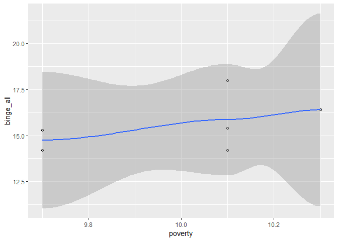

## Top 10 binge drinking states


```
## # A tibble: 10 x 5
##    state                stateabb binge_all binge_male binge_female
##    <chr>                <chr>        <dbl>      <dbl>        <dbl>
##  1 District of Columbia DC            25.6       30.5         21.3
##  2 North Dakota         ND            24.8       32.1         17.2
##  3 Wisconsin            WI            24.6       29.7         19.5
##  4 Minnesota            MN            21.3       26.5         16.2
##  5 Iowa                 IA            21.2       27.1         15.4
##  6 Guam                 GU            20.7       29.8         11.2
##  7 Nebraska             NE            20         27.2         13.1
##  8 Illinois             IL            19.9       25.6         14.5
##  9 Pennsylvania         PA            19.4       25.3         13.8
## 10 South Dakota         SD            19.3       24.3         14.3
```

## Scatter plot between the overall poverty prevalence and the prevalence of overall binge drinking in Maryland

<!-- -->

From the curve in the plot we could view a slight positive correlation between the overall poverty prevalence and the prevalence of overall binge drinking in Maryland. The more poverty prevalence we have in Maryland, the more binge drinking prevalence could be viewed in the overall population.

## Considering average annual growth rate


#### Top 5 states with the largest increases in binge drinking prevalence

```
## # A tibble: 5 x 2
##   state          growth_rate_in_percentage
##   <chr>                              <dbl>
## 1 Tennessee                           6.20
## 2 Guam                                2.62
## 3 West Virginia                       2.38
## 4 South Carolina                      1.82
## 5 Arkansas                            1.28
```

#### Top 5 states with the largest decreases in binge drinking prevalence

```
## # A tibble: 5 x 2
##   state        growth_rate_in_percentage
##   <chr>                            <dbl>
## 1 Oklahoma                         -5.70
## 2 Georgia                          -3.98
## 3 Rhode Island                     -3.88
## 4 Puerto Rico                      -3.66
## 5 Delaware                         -3.25
```

