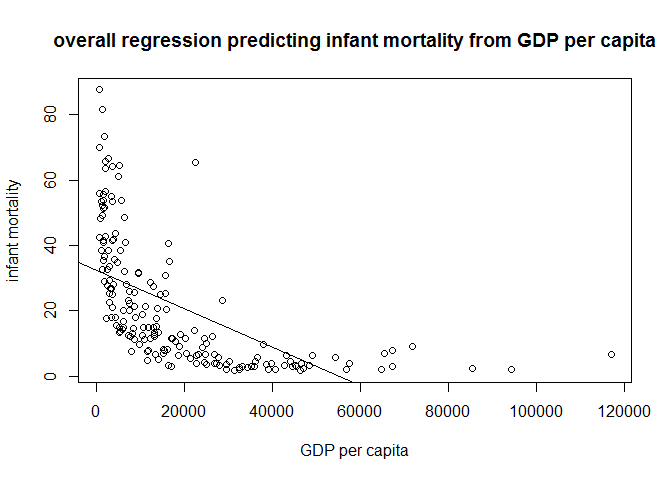
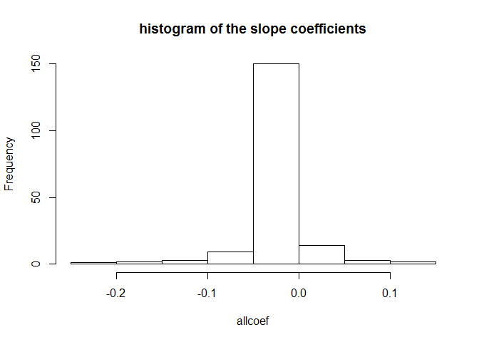

## 1. Functions in the R Base Package
#### a. Which base function has the longest name

```r
# install.packages("RJSONIO")
# install.packages("purrr")
library(RJSONIO)
library(purrr)
content <- mget(ls("package:base"), inherits = TRUE)
base_functions <- Filter(is.function, content)
names1 <- names(base_functions)
namelength<-map(names1,nchar)
namelength<-unlist(namelength)
names1[match(max(namelength),namelength)]
```

```
## [1] "getDLLRegisteredRoutines.character"
```

#### b. Which base function has the most arguments

```r
bf <- map(base_functions,safely(formals))
bf2 <- transpose(bf)$result
bf3 <- map(bf2,length)
bf3 <- unlist(bf3)
names1[match(max(bf3),bf3)]
```

```
## [1] "scan"
```

#### c. How many base functions have no arguments


```r
bf4 <- map(bf2,length)
length(which(bf4 == 0))
```

```
## [1] 224
```
These functions are quite primitive. They themselves could express certain meanings (such as relationship, direction, etc.) without requiring any other variables, conditions or constraints.


## 2. Infant Mortality and GPD per Capita
#### a. infant mortality rates
5 highest infant mortality rates in 2017

```r
# install.packages("WDI")
library(WDI)
WDI <- WDI(country = "all", indicator = c("NY.GDP.PCAP.PP.KD","SP.DYN.IMRT.IN"),start = 1960,
  end = 2017, extra = TRUE, cache = NULL) 
names(WDI)[names(WDI)=="NY.GDP.PCAP.PP.KD"]="gdpcap"
names(WDI)[names(WDI)=="SP.DYN.IMRT.IN"]="infmort"
library(dplyr)
WDI2 <- WDI %>%
  filter(WDI$region!="Aggregates") %>%
  filter(year==2017) 
WDI3 <- WDI2 %>%
  arrange(desc(infmort)) %>%
  dplyr::select(country,gdpcap)%>%
  head(5)
WDI3
```

```
##                    country    gdpcap
## 1 Central African Republic  661.2400
## 2             Sierra Leone 1390.3003
## 3                  Somalia        NA
## 4                     Chad 1768.1534
## 5         Congo, Dem. Rep.  808.1332
```

5 lowest infant mortality rates in 2017

```r
WDI4 <- WDI2 %>%
  arrange(infmort) %>%
  dplyr::select(country,gdpcap)%>%
  head(5)
WDI4
```

```
##      country   gdpcap
## 1    Iceland 46482.96
## 2   Slovenia 31400.84
## 3    Finland 40585.72
## 4      Japan 39002.22
## 5 San Marino 56861.47
```

#### b. Overall regression

```r
reg <- lm(infmort~gdpcap,data = WDI2)
summary(reg)
```

```
## 
## Call:
## lm(formula = infmort ~ gdpcap, data = WDI2)
## 
## Residuals:
##     Min      1Q  Median      3Q     Max 
## -20.536 -11.827  -4.865   7.718  55.647 
## 
## Coefficients:
##               Estimate Std. Error t value Pr(>|t|)    
## (Intercept)  3.234e+01  1.620e+00  19.961   <2e-16 ***
## gdpcap      -5.897e-04  6.064e-05  -9.724   <2e-16 ***
## ---
## Signif. codes:  0 '***' 0.001 '**' 0.01 '*' 0.05 '.' 0.1 ' ' 1
## 
## Residual standard error: 15.8 on 179 degrees of freedom
##   (34 observations deleted due to missingness)
## Multiple R-squared:  0.3457,	Adjusted R-squared:  0.342 
## F-statistic: 94.56 on 1 and 179 DF,  p-value: < 2.2e-16
```

```r
plot(WDI2$gdpcap,WDI2$infmort,main = "overall regression predicting infant mortality from GDP per capita",xlab="GDP per capita",ylab="infant mortality")
abline(reg)
```

<!-- -->


There is a negative correlation between infant mortality and GDP per capita across countries. The higher GDP per capita, the lower infant mortality.

#### c. Regression coefficient estimates by region, sorted

```r
options(scipen = 1000)
WDI5 <- WDI %>%
  filter(WDI$region!="Aggregates") 
WDI6 <- WDI5 %>%
  filter(is.na(gdpcap)!= TRUE)%>%
  filter(is.na(infmort)!=TRUE)

WDI7 <- WDI6 %>%
  split(WDI6$region)
WDI8<- WDI7[-1]
model <- map(WDI8,~lm(infmort ~ gdpcap, data =.,na.rm=TRUE)) %>%
  map(~ coef(.)) %>%
  map_dbl("gdpcap") %>%
  sort()
as.table(model)
```

```
##                 South Asia        Sub-Saharan Africa  
##            -0.005658713829            -0.002351682410 
## Latin America & Caribbean         East Asia & Pacific 
##            -0.001102494290            -0.000599510873 
##      Europe & Central Asia Middle East & North Africa 
##            -0.000492016137            -0.000277602136 
##              North America 
##            -0.000008223335
```

#### d. Regression by country
Percentage of positive relationship

```r
WDI9 <- WDI6 %>%
  split(WDI6$country)
WDI10<- WDI9[-1]
model2 <- map(WDI10,~lm(infmort ~ gdpcap, data =.))%>%
  map(coefficients) %>%
  map_dbl("gdpcap") 
nameslist <-names(model2[model2>0])
nameslist2 <- nameslist[is.na(nameslist)==FALSE]


modelframe <- map(WDI10,~lm(infmort ~ gdpcap, data =.))%>%
  map(summary)%>%
  map(~ coef(.)) 
sig <- modelframe[nameslist2] %>%
  as.data.frame()
sig1 <- sig[2,]%>%
  dplyr::select(contains("Pr...t..")) 
number<-length(sig1[sig1<0.05])
percentage <- number/length(modelframe)
paste(round(percentage,3)*100, "%", sep='')
```

```
## [1] "5.4%"
```

Histogram of the slope coefficients


```r
allcoef <- map(WDI10,~lm(infmort ~ gdpcap, data =.,na.rm=TRUE)) %>%
  map(~ coef(.)) %>%
  map_dbl("gdpcap")

hist(allcoef, main = "histogram of the slope coefficients")
```

<!-- -->


Which countries are most at odds with the overall regression?

```r
modelframe2 <- map(WDI10,~lm(infmort ~ gdpcap, data =.))%>%
  map(summary)%>%
  map(~ coef(.)) %>%
  as.data.frame() %>%
  dplyr::select(contains("Estimate"))
number <- match(max(allcoef,na.rm=TRUE),modelframe2[2,])
names(WDI10[number])
```

```
## [1] "Madagascar"
```

```r
number <- match(min(allcoef,na.rm=TRUE),modelframe2[2,])
names(WDI10[number])
```

```
## [1] "Malawi"
```

#### e. Added squared term
Average adjusted r squared, when not adding a squared term

```r
model3 <- map(WDI10,~lm(infmort ~gdpcap+I(gdpcap^2), data =.))%>%
  map(summary)%>%
  map_dbl("adj.r.squared")
model4 <- map(WDI10,~lm(infmort ~ gdpcap, data =.))%>%
  map(summary)%>%
  map_dbl("adj.r.squared")

model6 <- model4[model4>0]
sum(model6)/length(WDI10)
```

```
## [1] 0.6645495
```

Average adjusted r squared, when adding a squared term

```r
model5 <- model3[model3>0]
sum(model5)/length(WDI10)
```

```
## [1] 0.7460879
```

We can see that when adding a squared term (square of gdpcap), the adjusted r squared increases a lot. I would recommend to keep the squared term to make the model fit more.

